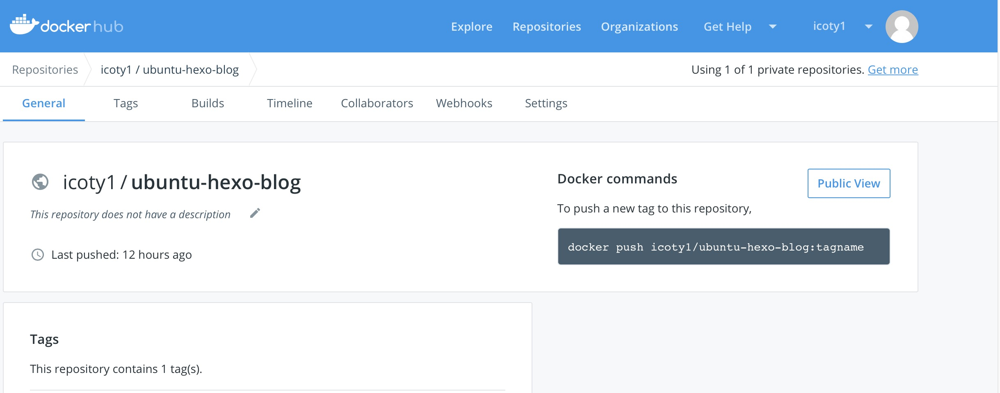
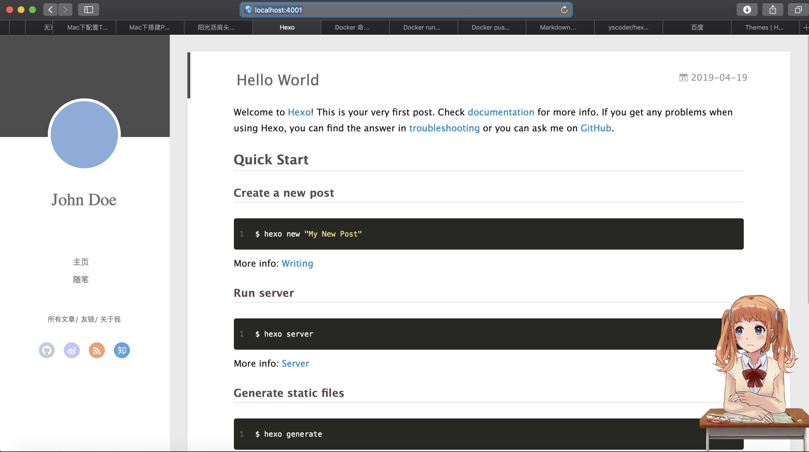
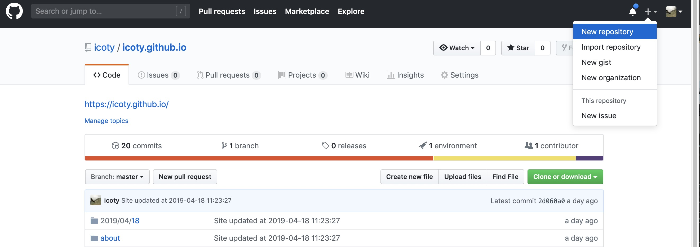
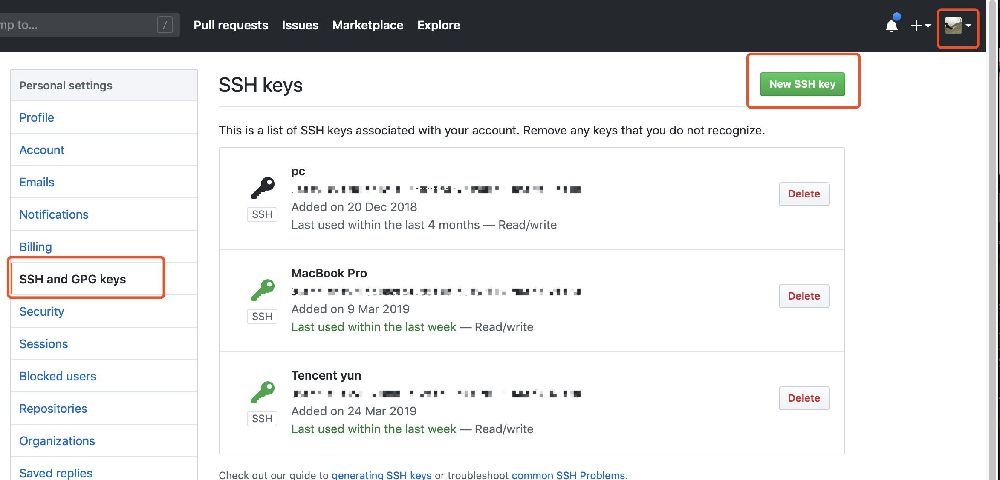
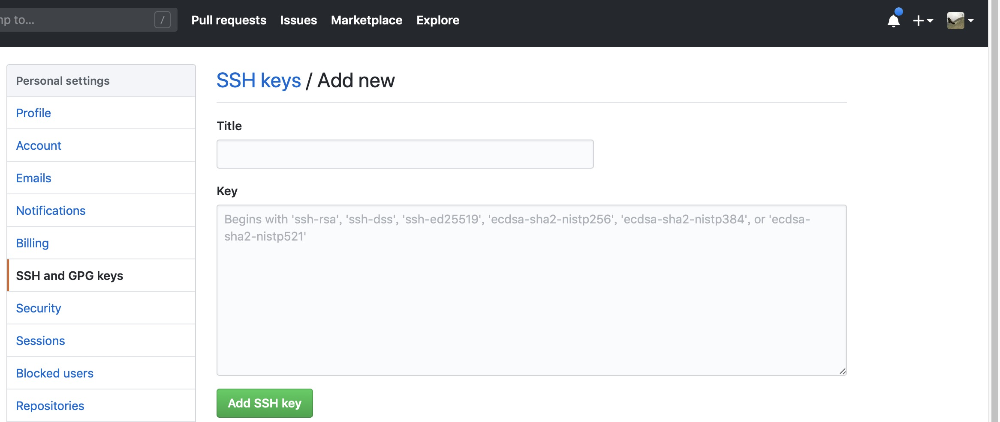
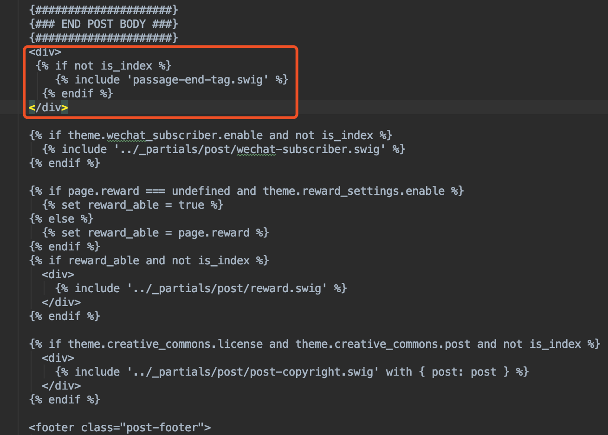
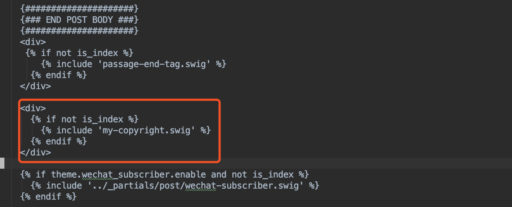

### 闲谈 

拿出你的气质，打开你的电脑，借你半小时搭建好属于你的hexo博客，小生用dockerfile自动帮你搭建好；
你只需要在你的mac或linux或windows上提前把docker安装好，如何安装不是我的重点，请参考[Docker安装](http://www.runoob.com/docker/ubuntu-docker-install.html)；
作为程序员，博客就像你的影子，我都已经忘了内心曾经多少次告诫自己，一定要搭建一个属于自己的技术博客，奈何日复一日过去了，近来终于落实到行动上来，所谓明日复明日，明日何其多，早晚要做的事，劝君晚做不如早做。

### 搭建Hexo

#### 获取基础镜像

Docker安装成功之后方能进行接下来的操作，如果对Docker基本命令不熟悉又想真懂的可以看下我的另一篇文章[Docker最简教程](https://icoty.github.io/2019/04/22/docker/)。首先从我的Docker Hub仓库上获取基础镜像：



``` bash
$ docker pull icoty1/ubuntu-hexo-blog # 从Docker hub上的icoty1用户下获取基础镜像
$ docker images # 查看本地所有镜像，会发现icoty1/ubuntu-hexo-blog已经被pull下来了
```

#### 生成Dockerfile

进入一个空的目录下新建空文件Dockerfile，复制如下内容：

``` bash
# 基础镜像
FROM icoty1/ubuntu-hexo-blog:latest

MAINTAINER icoty1 "https://icoty.github.io" 

EXPOSE 4000

# hexo部分插件安装，使支持rss，图片，字数统计等功能
RUN npm install -g hexo-cli 		\
&& npm install hexo-server --save 	\
&& hexo init blog && cd /blog 		\
&& npm install 				\
&& npm install hexo-deployer-git --save \
&& npm install hexo-migrator-rss --save \
&& npm install hexo-asset-image --save	\
&& npm install hexo-wordcount --save 	\
&& npm install hexo-generator-sitemap --save 		\
&& npm install hexo-generator-baidu-sitemap --save 	\
&& npm install hexo-helper-live2d --save 		\
&& git clone https://github.com/litten/hexo-theme-yilia.git themes/yilia \
&& sed "s/theme: landscape/theme: yilia/g" -i /blog/_config.yml
```

#### 更换主题

Dockerfile中的最后两行内容表示的含义是从github上把hexo-theme-yilia克隆下来并重命名成yilia，然后放到容器的/blog/themes/目录下，其中hexo-theme-yilia是hexo的主题，hexo有很多种主题，用每一种主题搭建出来的hexo博客界面美观和布局都不尽相同，你可以通过[hexo官网](https://hexo.io/themes/)上浏览每一种主题长啥样子，通过[github](https://github.com/search?q=hexo-theme)获取主题的源码仓库，选择一个你喜欢的主题，并相应的修改这两行。假如你从github选择的主题仓库地址是https://github.com/yscoder/hexo-theme-indigo.git ， 那么你需要按照如下方式进行修改，如果你就想用yilia，那么你不需要做任何修改，我用的主题是https://github.com/theme-next/hexo-theme-next.git

``` bash
&& git clone https://github.com/yscoder/hexo-theme-indigo.git themes/indigo \
&& sed "s/theme: landscape/theme: indigo/g" -i /blog/_config.yml
```

#### 构建Hexo镜像

在Dockerfile的同级目录执行：

``` bash
$ docker build -t icoty1/ubuntu-hexo .  # 把icoty1/ubuntu-hexo替换成你取的名字
$ docker images	 # 能够看到多出一条记录icoty1/ubuntu-hexo，并能看到该镜像的[IMAGE ID]
```

#### 启动容器

``` bash
/* 把[IMAGE ID]替换成上一步构建出来的镜像的ID，该句执行成功会多出来一个容器并有一个[CONTAINER ID]
 * -v /home/yangyu/blog/：/blog/是把本机的/home/yangyu/blog/目录映射到容器的/blog/目录
 * 通过目录映射，你只需要在本机编辑/home/yangyu/blog/目录下的文件，而不用每次都进入容器/blog/目录下编辑文件
 * -p 4000:4000 将主机的4000端口映射到容器的4000端口
 *\
$ docker run -d -ti -p 4000:4000 -v /home/yangyu/blog/：/blog/ [IMAGE ID] /bin/bash 
$ docker ps -a	# 执行该句列出当前所有的容器
$ docker exec -it [CONTAINER ID] /bin/bash # 根据前一步的容器ID进入该容器内部
$ cd /blog/ && hexo s # 进入容器内部的/blog/目录下，启动hexo
```

#### 浏览器测试

浏览器访问http://localhost:4000 ，出现下图说明已经成功，以后你的博客配置，文章撰写和发布等，都在/home/yangyu/blog/目录下进行，这和在容器内部/blog/目录下操作完全对等。



### Hexo部署到Github

[注册Github账户](https://github.com/join?source=header-home)，如果已经注册，跳过此步；
在github上仓库“用户名.github.io”，比如我的用户名为icoty，仓库名则为：icoty.github.io；



执行如下命令生成ssh key，执行完后复制~/.sshid_rsa.pub文件内的全部内容，按照图示添加ssh keys，并粘贴保存到Key栏中，Title栏随便取。

``` bash
$ cd ~/.ssh
$ ssh-keygen -t rsa -C "youremail@example.com" # 全程回车
$ git config --global user.name "你用github用户名"
$ git config --global user.email "你的github邮箱地址"
```





### 配置Hexo主题
编辑/blog/_config.yml文件，编辑标题、描述信息、Github信息，下图参见我的：

``` bash
# Site
title: 阳光沥肩头 仿佛自由人 # 标题
subtitle: 	# 子标题
description: Linux C++服务端 # 描述信息
keywords: 
author: icoty
language: zh-CN # 语言
timezone: # 时区

deploy:
  - type: git
    repository: git@github.com:icoty/icoty.github.io.git  # 设置repository对应的链接
    branch: master                                        # 设置提交到的分支
    message: Site updated at {{ now("YYYY-MM-DD HH:mm:ss") }} # 设置我们提交的信息
```

执行如下命令发布到github上，通过“https://你的github用户名.github.io”访问，我的是https://icoty.github.io

``` bash
$hexo generate
$hexo deploy # 部署到GitHub
```

编辑/blog/themes/yilia/_config.yml文件，自定义其他配置，如友链、评论、分享、头像等，这些配置并不是一定要做，做不做都行，只是配置的完善些，你的Hexo博客界面看起来美观些，如何配置在此不一一赘述，请自行查看对应主题的官方文档和Github说明。如果你能操作这里，说明我这个教程还是有效的，感谢你的坚持！

### [Hexo命令](https://hexo.io/zh-cn/docs/commands)
Hexo搭建好后，你可以写博客发布到GitHub 上，别人通过“https://你的github用户名.github.io”就能访问你的博客和看到你写的文章，而这个章节就是教你怎么在本地写你的博客，写博客用的MarkDown语法，推荐你安装MarkDown编辑器Typora。下面列出写博客过程中常用的命令，这些命令都需要走到/blog/目录下执行。

``` bash
$hexo new "my-hexo" #新建my-hexo文章，在/blog/source/_post/目录下生成my-hexo.md，在这个文件里面写你的文章
$hexo generate # 文章写好后保存，然后执行这条命令，生成静态页面至public目录
$hexo s # 然后开启预览访问端口（默认端口4000，'ctrl+c'关闭server，‘ctrl+z’放到后台运行），通过http://localhost:4000 查看效果，如果满意就执行下一条命令发布到github
$hexo deploy # 发布到github，通过https://你用github用户名.github.io 访问
$hexo clean # 有时你写文章和配置其他内容后，老是不生效，就执行下该命令清除缓存文件 (db.json) 和已生成的静态文件 (public)，不是删除，你的文章仍然在的
$nohup hexo s & # 启动hexo以后台方式运行
$hexo new page "About" #新建About页面，这个是配置Hexo界面多出来一个About布局
$hexo help  # 查看帮助
$hexo version  #查看Hexo的版本
```

### [MarkDown语法](https://www.jianshu.com/p/191d1e21f7ed)
这个比较基础，网上教程也一大堆，MarkDown很容易学，放心比九九表容易多了，只要你用markdown实际动手写过一篇博文后就上手了，因此没啥可说的。

### Next主题配置
接下来的内容是针对next主题的配置，因为我选择的是next，不同主题可能有差异，特此说明。

#### 修改文章内链接文本样式
打开themes/next/source/css/_common/components/post/post.styl文件，在文件最后且在@import之前添加如下代码：
``` bash
// 文章内链接文本样式
.post-body p a{
  color: #0593d3; //原始链接颜色
  border-bottom: none;
  border-bottom: 1px solid #0593d3; //底部分割线颜色
  &:hover {
    color: #fc6423; //鼠标经过颜色
    border-bottom: none;
    border-bottom: 1px solid #fc6423; //底部分割线颜色
  }
}
```

#### 文章末尾添加“文章结束”标记
在themes/next/layout/_macro/目录下新建passage-end-tag.swig，填入如下内容：
``` bash
<div>
    
        <div style="text-align:center;color: #ccc;font-size:14px;">-------------本文结束<i class="fa fa-paw"></i>感谢您的阅读-------------</div>
    
</div>
```

然后编辑themes/next/layout/_macro/post.swig，按照下图添加代码块：
``` bash
<div>
  
    
  
</div>
```


最后编辑themes/next/_config.yml，添加如下内容：
``` bash
# 文章末尾添加“本文结束”标记
passage_end_tag:
  enabled: true
```
#### 添加网页加载进度条
打开themes/next/_config.yml，搜索“pace:”，设置为true。
``` bash
pace: true
```

#### 设置文章的显示顺序
编辑node_modules/hexo-generator-index/lib/generator.js，在return之前添加如下代码：
``` bash
posts.data = posts.data.sort(function(a, b) {
if(a.top && b.top) { // 两篇文章top都有定义
    if(a.top == b.top) return b.date - a.date; // 若top值一样则按照文章日期降序排
    else return b.top - a.top; // 否则按照top值降序排
}
else if(a.top && !b.top) { // 以下是只有一篇文章top有定义，那么将有top的排在前面（这里用异或操作居然不行233）
    return -1;
}
else if(!a.top && b.top) {
    return 1;
}
else return b.date - a.date; // 都没定义按照文章日期降序排
})
```

然后在每篇文章的头部添加top字段，top值越大的文章显示越靠前。
``` bash
---
title: Hexo+Github博客最简教程-Dockerfile自动搭建
date: 2019-04-18 15:23:05
top: 6
tags: [Hexo, Dockerfile, Linux, Github]
categories: [IDE]
copyright: ture
---
```
#### 添加底部的小图标
打开themes/next/layout/_partials/footer.swig搜索with-love，修改为如下代码。从[fontawesom](https://fontawesome.com/icons?d=gallery&q=heart)选择你喜欢的图标名称，我这里选择的是heart。
``` bash
  <span class="with-love" id="animate">
    <i class="fa fa-heart" aria-hidden = "true"></i>
  </span>
```

#### 文章底部添加版权信息
在themes/next/layout/_macro/下新建 my-copyright.swig，填入如下内容：
``` bash

<div class="my_post_copyright">
  <script src="//cdn.bootcss.com/clipboard.js/1.5.10/clipboard.min.js"></script>
  
  <!-- JS库 sweetalert 可修改路径 -->
  <script src="https://cdn.bootcss.com/jquery/2.0.0/jquery.min.js"></script>
  <script src="https://unpkg.com/sweetalert/dist/sweetalert.min.js"></script>
  <p><span>本文标题:</span><a href="{{ url_for(page.path) }}">{{ page.title }}</a></p>
  <p><span>文章作者:</span><a href="/" title="访问 {{ theme.author }} 的个人博客">{{ theme.author }}</a></p>
  <p><span>发布时间:</span>{{ page.date.format("YYYY年MM月DD日 - HH:MM") }}</p>
  <p><span>最后更新:</span>{{ page.updated.format("YYYY年MM月DD日 - HH:MM") }}</p>
  <p><span>原始链接:</span><a href="{{ url_for(page.path) }}" title="{{ page.title }}">{{ page.permalink }}</a>
    <span class="copy-path"  title="点击复制文章链接"><i class="fa fa-clipboard" data-clipboard-text="{{ page.permalink }}"  aria-label="复制成功！"></i></span>
  </p>
  <p><span>许可协议:</span><i class="fa fa-creative-commons"></i> <a rel="license" href="https://creativecommons.org/licenses/by-nc-nd/4.0/" target="_blank" title="Attribution-NonCommercial-NoDerivatives 4.0 International (CC BY-NC-ND 4.0)">署名-非商业性使用-禁止演绎 4.0 国际</a> 转载请保留原文链接及作者。</p>  
</div>
<script> 
    var clipboard = new Clipboard('.fa-clipboard');
    $(".fa-clipboard").click(function(){
      clipboard.on('success', function(){
        swal({   
          title: "",   
          text: '复制成功',
          icon: "success", 
          showConfirmButton: true
          });
    });
    });  
</script>

```

然后在themes/next/source/css/_common/components/post/下新建my-post-copyright.styl，填入如下内容：
``` bash
.my_post_copyright {
  width: 85%;
  max-width: 45em;
  margin: 2.8em auto 0;
  padding: 0.5em 1.0em;
  border: 1px solid #d3d3d3;
  font-size: 0.93rem;
  line-height: 1.6em;
  word-break: break-all;
  background: rgba(255,255,255,0.4);
}
.my_post_copyright p{margin:0;}
.my_post_copyright span {
  display: inline-block;
  width: 5.2em;
  color: #b5b5b5;
  font-weight: bold;
}
.my_post_copyright .raw {
  margin-left: 1em;
  width: 5em;
}
.my_post_copyright a {
  color: #808080;
  border-bottom:0;
}
.my_post_copyright a:hover {
  color: #a3d2a3;
  text-decoration: underline;
}
.my_post_copyright:hover .fa-clipboard {
  color: #000;
}
.my_post_copyright .post-url:hover {
  font-weight: normal;
}
.my_post_copyright .copy-path {
  margin-left: 1em;
  width: 1em;
  +mobile(){display:none;}
}
.my_post_copyright .copy-path:hover {
  color: #808080;
  cursor: pointer;
}
```

接着编辑themes/next/layout/_macro/post.swig文件，按照下图位置添加如下代码：
``` bash
<div>
      
        
      
</div>
```



接着在themes/next/source/css/_common/components/post/post.styl文件最后添加如下代码：
``` bash
@import "my-post-copyright"
```
然后，还需要在文章的头部添加copyright字段：
``` bash
---
title: Hexo+Github博客最简教程-Dockerfile自动搭建
date: 2019-04-18 15:23:05
top: 6
tags: [Hexo, Dockerfile, Linux, Github]
categories: [IDE]
copyright: ture
---
```

最后，编辑根目录下的_config.yml文件，把url换成你的主页：
``` bash
# URL
## If your site is put in a subdirectory
url: https://icoty.github.io  # 这里换成你的主页
root: /
permalink: :year/:month/:day/:title/
permalink_defaults:
```
#### 添加网易云音乐外链
登陆网易云音乐网页版；点击个人头像“我的主页”；然后能够看到“我创建的歌单”，如果没有则创建一个歌单；选中一个歌单点进去，能够看到“歌曲列表”，点击“歌曲列表”右边的“生成外链播放器”；然后点击右下角的“复制代码”，粘贴到themes/next/layout/_macro/sidebar.swig文件中指定的位置即可，我的是放在侧栏中"友链"下面的。

#### 设置文章缩略显示

编辑themes/next/_config.yml，搜索auto_excerpt，设置为true：
``` bash
# Automatically Excerpt (Not recommend).
# 设置文章不显示全部  点进去再显示全部
# Use <!-- more --> in the post to control excerpt accurately.
auto_excerpt:
  enable: true
  length: 150
```

#### 自定义代码块样式

打开themes\next\source\css\_custom\custom.styl，添加如下内容：
``` bash
// Custom styles.
code {
    color: #ff7600;
    background: #fbf7f8;
    margin: 2px;
}
// 大代码块的自定义样式
.highlight, pre {
    margin: 5px 0;
    padding: 5px;
    border-radius: 3px;
}
.highlight, code, pre {
    border: 1px solid #d6d6d6;
}
```

#### 把一篇文章归为多类
如下会把该文章归为Linux/IPC类。
``` bash
categories:
  - Linux
  - IPC
```
如下会把该文章归为Linux/IPC和TCP两类。
``` bash
categories:
  - [Linux, ICP]
  - TCP
```

### 参考文献
https://www.jianshu.com/p/9f0e90cc32c2
https://www.jianshu.com/p/bff1b1845ac9