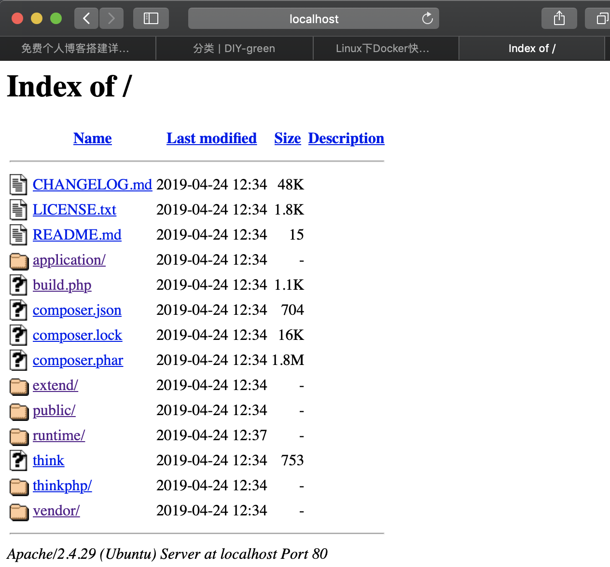
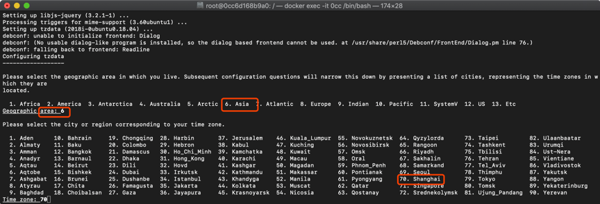
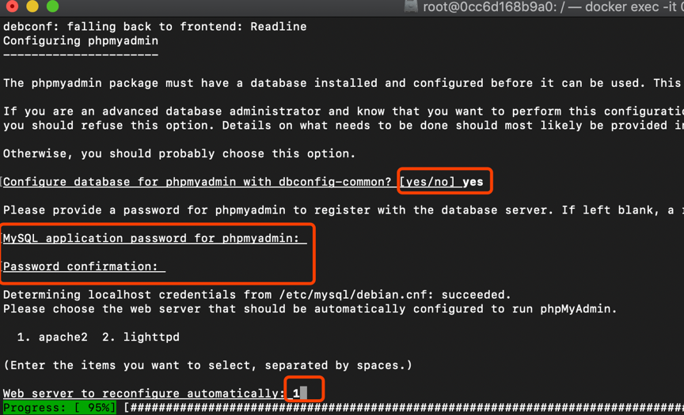

若你的mac或Linux环境上未安装Docker，请移步[Docker安装](http://www.runoob.com/docker/ubuntu-docker-install.html)，确认安装成功之后再进行下文内容。如果你不了解Docker如何操作，但是你又想彻底弄懂Docker命令，可以看我另一篇文章[Docker最简教程](https://icoty.github.io/2019/04/22/docker/)。

### 拿来即用
#### 获取LAMP
LAMP镜像我已经搭建好并且我已经测试过了，没有问题。你只需要直接拿去用，执行如下命令：
``` bash
$docker pull icoty1/lamp:v1.1.0
$docker images # 能够看到icoty1/lamp:v1.1.0已经被拉到你本地
$docker run -d -ti -p 80:80 -p 3306:3306 -v /Users/yangyu/app/:/var/www/html/ icoty1/lamp:v1.1.0 /bin/bash start.sh # 运行一个容器，目录/Users/yangyu/app/是你本机PHP应用位置
```
/Users/yangyu/app/下存放的是public、thinkphp、vendor、runtime等内容。然后访问http://localhost 能够看到PHP应用目录下的内容，如下图，说明已经成功。


然后访问http://localhost/public/index.php ，这个是PHP的入口。如果浏览器打开提示权限不够，不要慌，检查下你无法访问的那个目录下是否存在.htaccess文件，如果有则删除就好了，如果没有则执行如下命令。

``` bash
$docker exec -it [CONTAINER ID] /bin/bash # 进入前面启动的容器中
$chmod -R 0777 /var/www/html/ # 赋予最高权限
$sh start.sh # start.sh在根目录下，是重启服务用的
```
访问phpadmin：http://localhost/phpmyadmin/index.php ，登陆的用户名和密码均为phpmyadmin，登陆后你能够在浏览器上一目了然的对所有数据表进行操作。

容器内根目录下有个start.sh文件，每次需要重启apache服务和mysql服务时只需要执行这个脚本就好了，命令如下：

``` bash
$sh start.sh
```
#### LAMP版本
Ubuntu 18.04.2，PHP 7.2.15，mysql 5.7.25，同时也安装了phpmyadmin。下面是查看版本的命令。mysql数据库的root账户密码是root，phpmyadmin账户密码是phpmyadmin ，你可以把密码修改成你的，[mysql修改用户密码](https://www.cnblogs.com/mmx8861/p/9062363.html)。

``` bash
root@4f5e11ebccac:/# cat /etc/issue
Ubuntu 18.04.2 LTS \n \l

root@4f5e11ebccac:/# php -v
PHP 7.2.15-0ubuntu0.18.04.2 (cli) (built: Mar 22 2019 17:05:14) ( NTS )
Copyright (c) 1997-2018 The PHP Group
Zend Engine v3.2.0, Copyright (c) 1998-2018 Zend Technologies
    with Zend OPcache v7.2.15-0ubuntu0.18.04.2, Copyright (c) 1999-2018, by Zend Technologies
root@4f5e11ebccac:/# mysql -u root -p
Enter password: 
Welcome to the MySQL monitor.  Commands end with ; or \g.
Your MySQL connection id is 9
Server version: 5.7.25-0ubuntu0.18.04.2 (Ubuntu)
```
到这里你的目的就已经达到了，一个完整LAMP服务已经在你本机上跑起来并且能用了。下面的内容是我制作icoty1/lamp:v1.1.0的过程，如果你有兴趣，或者想知道我是怎么制作出来的，欢迎继续围观。

### icoty1/lamp:v1.1.0制作过程

#### 获取ubuntu基础镜像

``` bash
$ docker pull i icoty1/ubuntu:18.04.2-LTS  # 从icoty1仓库拉取基础镜像并运行一个容器
```

#### 安装依赖

进入前面运行的容器中安装接下来的内容。
##### mysql
``` bash
$apt-get update
$apt-get upgrade -y 
$apt-get dist-upgrade -y
$apt-get install vim -y
$apt-get install mysql-server mysql-client  -y
```
##### apache/php
``` bash
$apt-get install apache2 -y
$vi /etc/apache2/apache2.conf # 添加 ServerName localhost:80
$apt-get install php7.2 -y # 这个过程中需要选择国家和时区，如图。
$apt-get install libapache2-mod-php7.2
$apt-get install php7.2-mysql -y 
```


##### phpmyadmin
``` bash
$apt-get install php-mbstring php7.0-mbstring php-gettext
$service apache2 restart
$apt-get install phpmyadmin # 这个过程中会自动创建mysql用户名phpmyadmin，需要手动输入密码，如图。
```


##### 使apache解析php文件
 vi /etc/apache2/apache2.conf，添加如下内容，让apache服务知道libphp7.2.so库在哪里，找不到这个动态库就无法解析php文件。
``` bash
# add by yangyu, current dictory is '/etc/apache2/', so '../../usr/lib/apache2/modules/libphp7.2.so' = '/usr/lib/apache2/modules/libphp7.2.so'
LoadModule php7_module ../../usr/lib/apache2/modules/libphp7.2.so
AddType application/x-httpd-php .php
DirectoryIndex index.php index.htm index.html
```
到此，这个容器内已经搭建好了LAMP服务，使用docker commit命令把这个容器提交为镜像icoty1/lamp:v1.1.0，然后push到我的docker hub仓库上，你所pull的正是我push上去的。

### 参考文献

https://www.cnblogs.com/impy/p/8040684.html # lamp
https://linux.cn/article-7463-1.html # lamp
https://blog.csdn.net/longgeaisisi/article/details/78448525 # lamp
https://www.cnblogs.com/mmx8861/p/9062363.html # mysql密码修改

