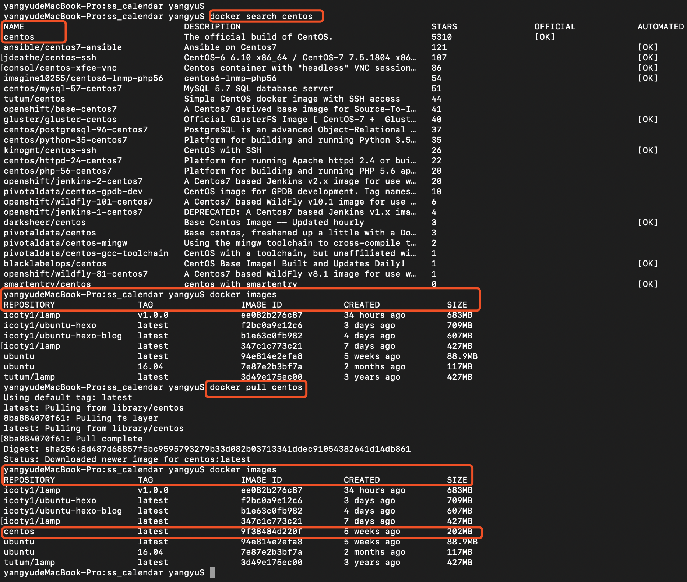
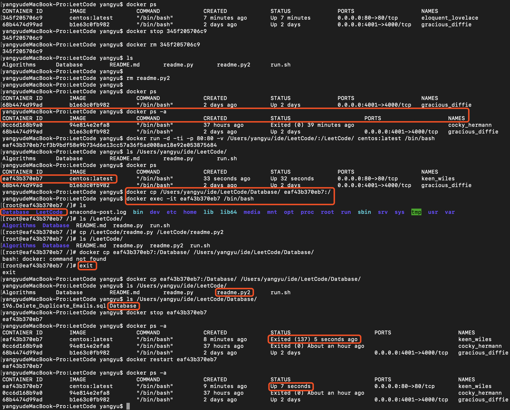
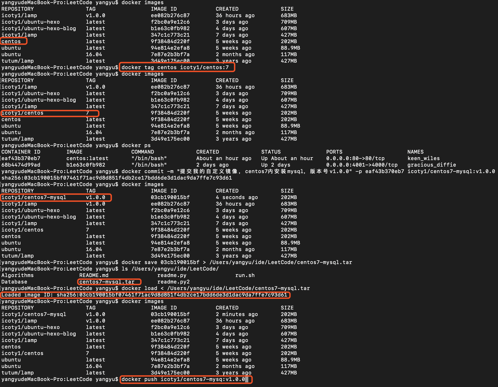
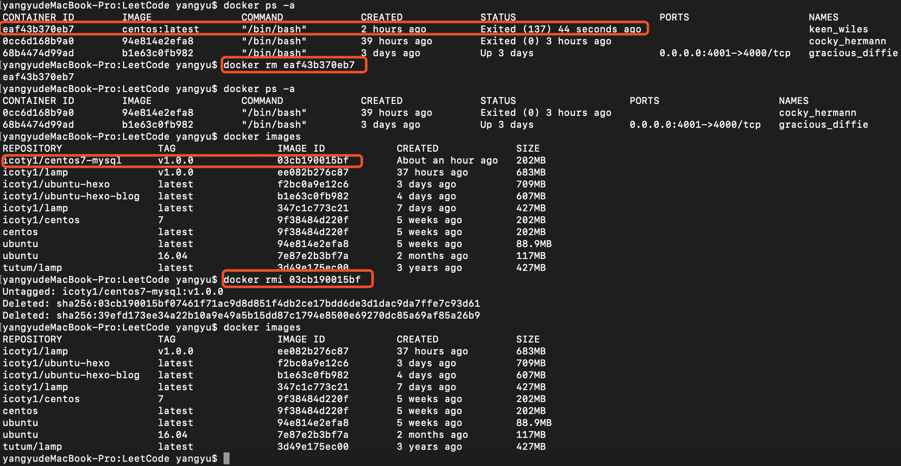
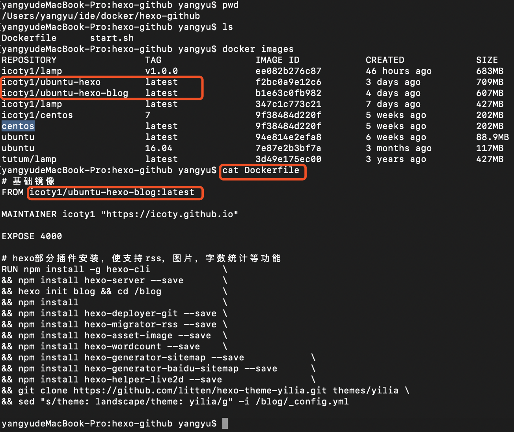

本文旨在让你用最短的时间弄懂Docker命令操作，什么虚拟化都太泛泛了，不讲大道理，实践出真知，让你从此的日常开发和工作中在面对Docker时不再茫然失措而是得心应手。本文也不谈安装，我实在认为作为程序员，要是我在这里教你如何安装Docker，既是在浪费你的时间也是在浪费我的时间，请参考[Docker安装](http://www.runoob.com/docker/ubuntu-docker-install.html)；

Docker Hub是Docker官方维护的一个公共仓库，其中已经包括了数量超过15 000 的镜像，开发者可以注册自己的账号，并自定义自己的镜像进行存储，需要的时候可以直接拿来用，同时也能够分享，有点类似于Github，如想注册可移步 [Docker Hub](https://hub.docker.com)，注册与否不影响接下来的操作。

### 实践出真知

我认为只要你不是专门研究这个的，那么你只需学会如何使用Docker的一些基本命令，使自己的日常开发和工作不受阻碍，弄清Docker和容器之间的区别，为什么现在很多企业流行Docker，这个东西解决了啥问题，有啥优势就够了。关于Docker是什么有何优势，这里挑了一个简洁的[博客链接](https://blog.csdn.net/shnsuohaonan/article/details/80651439)。

接下来从零开始，首先从docker hub仓库上拉取centos镜像，带你走进docker日常命令，学会这些命令，足以应对你的日常开发和工作中关于docker的问题。

search: 从docker hub仓库搜索带centos的所有镜像。
``` bash
$docker seach centos
```

images: 查看本地所有镜像，pull前左侧REPOSITORY栏无centos。REPOSITORY表示镜像被归入到本地的仓库，比如icoty1/lamp:v1.0.0表示本地icoty1仓库下有一个镜像名为lamp,其TAG(版本)为v1.0.0，每个镜像有一个IMAGE ID唯一标识该镜像，SIZE为镜像大小。
``` bash
$docker images
```

pull: 从docker hub远程仓库把centos镜像拉到本地，pull后再次执行images，会发现centos已经被拉到本地。
``` bash
$docker pull centos 
```



ps: 只列出正在运行的容器。
``` bash
$docker ps
```

ps -a: 列出所有容器, 每一个容器有一个CONTAINER ID唯一标识该容器；IMAGE表示该容器是基于哪个镜像生成的，COMMAND是容器启动时执行的命令，可以传入也可以不传入；STATUS是容器当前的状态，Exit是已停止，Up是正在运行。
``` bash
$docker ps -a
```

run: 从镜像衍生一个新的容器并运行；-d后台模式运行容器，-i交互模式运行容器；-p把主机80关口映射到容器的80端口，因为容器具有封闭性，容器外部不能直接访问容器内部的端口，通过映射后，主机80端口收到数据后会转发到容器内部的80端口，不过在容器内是可以直接访问容器外的主机的；-v把主机的/Users/yangyu/ide/LeetCode/目录映射到容器的/LeetCode/，容器内若无/LeetCode/目录会自动创建，用于实现主机和容器之间的目录共享，在两个目录下操作文件是对等的；centos:latest是镜像名称，可以换成IMAGE ID，二者等价；/bin/bash是容器启动时执行的命令，还可以带参数，这个不懂的可以搜索下。执行docker run后再次执行ps命令，能够看到运行中的容器多了一个。
``` bash
$docker run -d -ti -p 80:80 -v /Users/yangyu/ide/LeetCode/:/LeetCode/ centos:latest /bin/bash 
```

cp: 拷贝主机/Users/yangyu/ide/LeetCode/Database/目录到容器eaf43b370eb7根目录。
``` bash
$docker cp /Users/yangyu/ide/LeetCode/Database/ eaf43b370eb7:/
```

exec: 执行该命令进入容器eaf43b370eb7内，进入容器后在容器内/LeetCode/目录下新建readme.py2，在主机/Users/yangyu/ide/LeetCode/目录下能够看到该文件。
``` bash
$docker exec -it eaf43b370eb7 /bin/bash
$cp /LeetCode/readme.py /LeetCode/readme.py2 
```

cp: 从容器eaf43b370eb7根目录下拷贝目录/Database到主机的/Users/yangyu/ide/LeetCode/Database/目录下。
``` bash
$docker cp eaf43b370eb7:/Database/ /Users/yangyu/ide/LeetCode/Database/
```

stop/restart: 停止容器eaf43b370eb7然后查看其状态变为Exited；然后通过restart命令重启，容器又处于运行态。
``` bash
$docker stop eaf43b370eb7
$docker restart eaf43b370eb7
```


tag: 把centos镜像归入icoty1仓库下名称为centos，TAG为7，TAG随你定。
``` bash
$docker tag centos icoty1/centos:7
```

commit: 最初pull下来的centos镜像是最简版本，里面没有安装mysql vim等；最初pull下来后基于其运行一个容器，你在容器内部可以安装你需要的环境，比如mysql，apache，nginx，hexo博客等，安装好后通过commit命令把容器提交为一个新的镜像，以后凡是从这个新的镜像运行的容器都带有你安装的内容。-m是提交说明；-p是执行commit命令时暂停该容器；eaf43b370eb7是容器ID。
``` bash
$docker commit -m "提交我的自定义镜像，centos7内安装mysql，版本号v1.0.0" -p eaf43b370eb7 icoty1/centos7-mysql:v1.0.0
```

save: 把镜像03cb190015bf打包成主机目录/Users/yangyu/ide/LeetCode/下的centos7-mysql.tar，然后你可以通过U盘拷贝到其他机器上，在其他机器上通过load命令可以把centos7-mysql.tar加载成一个镜像。
``` bash
$docker save 03cb190015bf > /Users/yangyu/ide/LeetCode/centos7-mysql.tar
```

load: 把centos7-mysql.tar加载为镜像，因为这个包是从我主机上的镜像03cb190015bf打出来的，所以执行load的时候直接返回镜像03cb190015bf，如果在其他机器上执行会生成一个新的镜像ID。
``` bash
$docker load < /Users/yangyu/ide/LeetCode/centos7-mysql.tar 
```

push:  把本地icoty1仓库下TAG为v1.0.0的镜像icoty1/centos7-mysql推到远程仓库docker hub上的icoty1仓库下保存，执行push前需要在本地icoty1已经登陆。push成功之后，其他人就可以通过pull命令拉取你的镜像使用了，相当于git clone操作。
``` bash
$docker push icoty1/centos7-mysql:v1.0.0
$docker pull icoty1/centos7-mysql:v1.0.0
```



rm: 删除容器eaf43b370eb7，运行中的容器无法删除。
``` bash
$docker rm eaf43b370eb7
```

rmi: 删除镜像03cb190015bf，在这之前必须删除由该镜像衍生出来的所有容器删除，否则会删除失败，执行该命令后通过images发现镜像已经没有了。
``` bash
$docker rmi 03cb190015bf
```


build: 如下以我搭建hexo博客的Dockerfile举例说明。
``` bash
# 基础镜像，icoty1/ubuntu-hexo-blog:latest在本地仓库必须已经存在
FROM icoty1/ubuntu-hexo-blog:latest

# 维护人员信息，可写可不写
MAINTAINER icoty1 "https://icoty.github.io" 

# 暴露容器的4000端口，这样主机就可以映射端口到4000了
EXPOSE 4000

/*自动安装所需环境，可替换成安装mysql vim等你需要的命令
 *hexo部分插件安装，使支持rss，图片，字数统计等功能
 */
RUN npm install -g hexo-cli 		\
&& npm install hexo-server --save 	\
&& hexo init blog && cd /blog 		\
&& npm install 				\
&& npm install hexo-deployer-git --save \
&& npm install hexo-migrator-rss --save \ 
&& npm install hexo-asset-image --save	\
&& npm install hexo-wordcount --save 	\
&& npm install hexo-generator-sitemap --save 		\ 
&& npm install hexo-generator-baidu-sitemap --save 	\ 
&& npm install hexo-helper-live2d --save 		\
&& git clone https://github.com/litten/hexo-theme-yilia.git themes/yilia \
&& sed "s/theme: landscape/theme: yilia/g" -i /blog/_config.yml
```
``` bash
$ docker build -t icoty1/ubuntu-hexo . # icoty1/ubuntu-hexo是新的镜像的名字
$ docker images	 # build后会多出icoty1/ubuntu-hexo镜像
```


### 镜像与容器

为了便于理解，你可以把镜像理解成一个初始模版A，通过这个模板A你可以复制出模板B、模板C等，模板B和模板C在这里就相当于容器，突然某一天你发现模板A现有的内容已经不能满足你的需求了（比如模板A没有安装Mysql，而你需要安装Mysql），这时你就只能自定义新的模板(相当于自定义新的符合你的要求的镜像)，而自定义方式则可以从模板B或模板C中安装Mysql，安装成功之后，通过docker commit命令将模板B或模板C提交成一个新的初始模板A1（也就是新的镜像），以后所有从模板A1运行的容器就都有Mysql了，然后你就有模板A和模板A1了（就是两个镜像）。

### 建议
实际操作部分，对各个命令有疑问的，相信我，直接执行一遍才是解决你心中疑虑的不二之法，如果你的命令参数不正确，顶多就是报错和执行不成功，不会让你的主机崩溃，最坏也就不过重新执行一遍，IT这个职业，其本身就是一个不断试错、犯错和总结经验的过程，如果你学到了，请我喝奶茶吧，小生会一直奋斗在原创的路上。

### 参考文献

[Docker命令](http://www.runoob.com/docker/docker-command-manual.html)
[Docker中文社区](http://www.docker.org.cn/index.html)