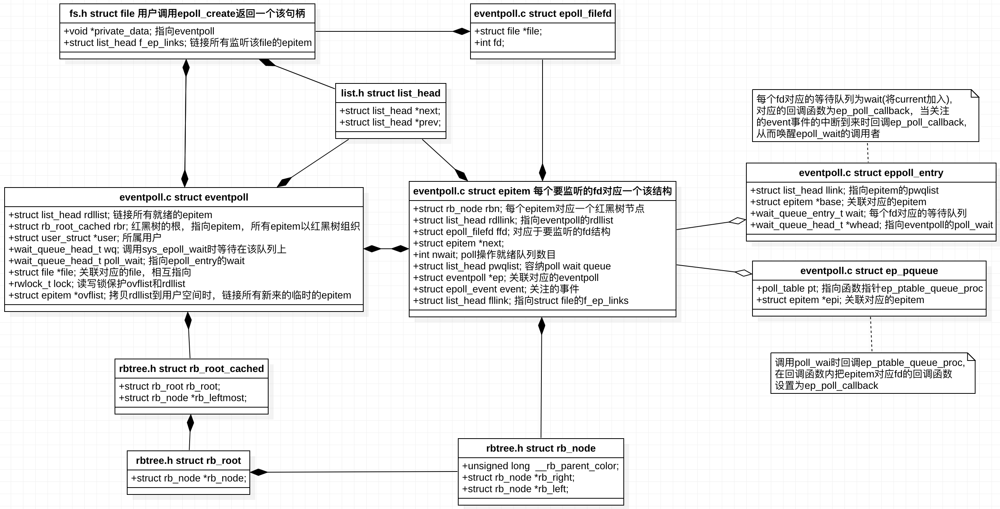

## API

epoll提供给用户进程的接口有如下四个，本文基于linux-5.1.4源码详细分析每个API具体做了啥工作，通过UML时序图理清内核内部的函数调用关系。

1. int epoll_create1(int size)；

	创建一个epfd句柄，size为0时等价于int epoll_create(0)。
	
2. int epoll_ctl(int epfd, int op, int fd, struct epoll_event *event)；

   向epfd上添加/修改/删除fd。
	
3. 	int epoll_wait(int epfd, struct epoll_event *events, int maxevents, int timeout)；

   返回所有就绪的fd。


## 内核数据结构

先上一张UML类图，从整体进行把握，图中已经标出各个数据结构所在的文件。



下面贴出各个数据结构代码，切记，实际在过代码的时候，其实我们没有必要对每一个变量和每一行代码咬文嚼字，也不建议这样去做，我们只需要重点关注主要的数据成员和那些关键的代码行，把心思和精力投入到我们最该关注的那部分，从框架层面去把握整体，抓准各个模块的核心，各个模块之间如何耦合，如何同步，如何通信等，这才是能够让你快速进步的最优路线。

```bash
/*
* Each file descriptor added to the eventpoll interface will
* have an entry of this type linked to the "rbr" RB tree.
* Avoid increasing the size of this struct, there can be many thousands
* of these on a server and we do not want this to take another cache line.
*/
struct epitem {
    union {
        /* RB tree node links this structure to the eventpoll RB tree */
        struct rb_node rbn;
        /* Used to free the struct epitem */
        struct rcu_head rcu;
    };

    /* List header used to link this structure to the eventpoll ready list */
    struct list_head rdllink;

    /*
    * Works together "struct eventpoll"->ovflist in keeping the
    * single linked chain of items.
    */
    struct epitem *next;

    /* The file descriptor information this item refers to */
    struct epoll_filefd ffd;

    /* Number of active wait queue attached to poll operations */
    int nwait;

    /* List containing poll wait queues */
    struct list_head pwqlist;

    /* The "container" of this item */
    struct eventpoll *ep;

    /* List header used to link this item to the "struct file" items list */
    struct list_head fllink;

    /* wakeup_source used when EPOLLWAKEUP is set */
    struct wakeup_source __rcu *ws;

    /* The structure that describe the interested events and the source fd */
    struct epoll_event event;
};

/*
* This structure is stored inside the "private_data" member of the file
* structure and represents the main data structure for the eventpoll
* interface.
*/
struct eventpoll {
    /*
    * This mutex is used to ensure that files are not removed
    * while epoll is using them. This is held during the event
    * collection loop, the file cleanup path, the epoll file exit
    * code and the ctl operations.
    */
    struct mutex mtx;

    /* Wait queue used by sys_epoll_wait() */
    wait_queue_head_t wq;

    /* Wait queue used by file->poll() */
    wait_queue_head_t poll_wait;

    /* List of ready file descriptors */
    struct list_head rdllist;

    /* Lock which protects rdllist and ovflist */
    rwlock_t lock;

    /* RB tree root used to store monitored fd structs */
    struct rb_root_cached rbr;

    /*
    * This is a single linked list that chains all the "struct epitem" that
    * happened while transferring ready events to userspace w/out
    * holding ->lock.
    */
    struct epitem *ovflist;

    /* wakeup_source used when ep_scan_ready_list is running */
    struct wakeup_source *ws;

    /* The user that created the eventpoll descriptor */
    struct user_struct *user;

    struct file *file;

    /* used to optimize loop detection check */
    int visited;
    struct list_head visited_list_link;

#ifdef CONFIG_NET_RX_BUSY_POLL
    /* used to track busy poll napi_id */
    unsigned int napi_id;
#endif
};

/* eppoll_entry主要完成epitem和epitem事件发生时的callback（ep_poll_callback）
 * 函数之间的关联，并将上述两个数据结构包装成一个链表节点，
 * 挂载到目标文件file的waithead中。
 * Wait structure used by the poll hooks
 */
struct eppoll_entry {
    /* List header used to link this structure to the "struct epitem" */
    struct list_head llink;

    /* The "base" pointer is set to the container "struct epitem" */
    struct epitem *base;

    /*
     * Wait queue item that will be linked to the target file wait
     * queue head.
     */
    wait_queue_entry_t wait;

    /* The wait queue head that linked the "wait" wait queue item */
    wait_queue_head_t *whead;
};

/* ep_pqueue主要完成epitem和callback函数的关联。
 * 然后通过目标文件的poll函数调用callback函数ep_ptable_queue_proc。
 * Poll函数一般由设备驱动提供，以网络设备为例，
 * 他的poll函数为sock_poll然后根据sock类型调用不同的poll函数如：
 * packet_poll。packet_poll在通过datagram_poll调用sock_poll_wait，
 * 最后在poll_wait实际调用callback函数（ep_ptable_queue_proc）
 * Wrapper struct used by poll queueing
 */
struct ep_pqueue {
    poll_table pt;
    struct epitem *epi;
};

/* Used by the ep_send_events() function as callback private data */
struct ep_send_events_data {
    int maxevents;
    struct epoll_event __user *events;
    int res;
};

struct fd {
    struct file *file;
    unsigned int flags;
};
```

## 全局调用关系

再贴一张各个API从用户进程陷入到内核态并执行系统调用的详细过程，以及client发数据过来时触发ep_poll_callback回调函数的执行流程。


## epoll模块初始化&内存池开辟

epoll是内核的一个module，内核启动时会初始化这个module。

```bash
// fs/eventpoll.c
static int __init eventpoll_init(void)
{
    struct sysinfo si;

    si_meminfo(&si);
    /*
     * Allows top 4% of lomem to be allocated for epoll watches (per user).
     */
    max_user_watches = (((si.totalram - si.totalhigh) / 25) << PAGE_SHIFT) /
        EP_ITEM_COST;
    BUG_ON(max_user_watches < 0);

    /*
     * Initialize the structure used to perform epoll file descriptor
     * inclusion loops checks.
     */
    ep_nested_calls_init(&poll_loop_ncalls);

#ifdef CONFIG_DEBUG_LOCK_ALLOC
    /* Initialize the structure used to perform safe poll wait head wake ups */
    ep_nested_calls_init(&poll_safewake_ncalls);
#endif

    /*
     * We can have many thousands of epitems, so prevent this from
     * using an extra cache line on 64-bit (and smaller) CPUs
     */
    BUILD_BUG_ON(sizeof(void *) <= 8 && sizeof(struct epitem) > 128);

    // 提前开辟eventpoll_epi内存池,UML时序图的第21步alloc时直接从内存池里取,
    // 而不是重新调用malloc,效率得以提高
    /* Allocates slab cache used to allocate "struct epitem" items */
    epi_cache = kmem_cache_create("eventpoll_epi", 
        		sizeof(struct epitem),0, placehold_flag, 0);

    // 提前开辟eventpoll_pwq内存池,UML时序图的第28步alloc时直接从内存池里取
    // 而不是重新调用malloc,效率得以提高
    /* Allocates slab cache used to allocate "struct eppoll_entry" */
    pwq_cache = kmem_cache_create("eventpoll_pwq",
        sizeof(struct eppoll_entry), 0, SLAB_PANIC|SLAB_ACCOUNT, NULL);

    return 0;
}
fs_initcall(eventpoll_init);
```

## epoll_create

用户空间调用epoll_create(0)或epoll_create1(int)，其实质就是在名为"eventpollfs"的文件系统里创建了一个新文件，同时为该文件申请一个fd，绑定一个inode，最后返回该文件句柄。

### epoll_create/epoll_create1陷入内核

```bash
// fs/eventpoll.c
SYSCALL_DEFINE1(epoll_create1, int, flags)
{
    return do_epoll_create(flags);
}

SYSCALL_DEFINE1(epoll_create, int, size)
{
    if (size <= 0)
        return -EINVAL;
    return do_epoll_create(0);
}
```

### do_epoll_create/ep_alloc

```bash
/*
 * fs/eventpoll.c
 * Open an eventpoll file descriptor.
 */
static int do_epoll_create(int flags)
{
    int error, fd;
    struct eventpoll *ep = NULL;
    struct file *file;

    /* Check the EPOLL_* constant for consistency.  */
    BUILD_BUG_ON(EPOLL_CLOEXEC != O_CLOEXEC);

    if (flags & ~EPOLL_CLOEXEC)
        return -EINVAL;
    /*
     * 申请一个struct eventpoll内存空间,执行初始化后赋给ep
     * Create the internal data structure ("struct eventpoll").
     */
    error = ep_alloc(&ep);
    if (error < 0)
        return error;
    /*
     * 获取一个未使用的fd句柄
     * Creates all the items needed to setup an eventpoll file. That is,
     * a file structure and a free file descriptor.
     */
    fd = get_unused_fd_flags(O_RDWR | (flags & O_CLOEXEC));
    if (fd < 0) {
        error = fd;
        goto out_free_ep;
    }
    file = anon_inode_getfile("[eventpoll]", &eventpoll_fops, ep,
                              O_RDWR | (flags & O_CLOEXEC));
    if (IS_ERR(file)) {
        error = PTR_ERR(file);
        goto out_free_fd;
    }
    ep->file = file;
    // 绑定fd和file
    fd_install(fd, file);
    // 这个fd就是epfd句柄,返回给用户进程的
    return fd;

out_free_fd:
    put_unused_fd(fd);
out_free_ep:
    ep_free(ep);
    return error;
}


// fs/eventpoll.c
// 形参是一个二级指针,该接口就是简单的分配一个struct eventpoll,然后执行初始化工作
static int ep_alloc(struct eventpoll **pep)
{
    int error;
    struct user_struct *user;
    struct eventpoll *ep;

    user = get_current_user();
    error = -ENOMEM;
    ep = kzalloc(sizeof(*ep), GFP_KERNEL);
    if (unlikely(!ep))
        goto free_uid;

    mutex_init(&ep->mtx);
    rwlock_init(&ep->lock);
    init_waitqueue_head(&ep->wq);
    init_waitqueue_head(&ep->poll_wait);
    INIT_LIST_HEAD(&ep->rdllist);
    ep->rbr = RB_ROOT_CACHED;
    ep->ovflist = EP_UNACTIVE_PTR;
    ep->user = user;

    *pep = ep;

    return 0;

free_uid:
    free_uid(user);
    return error;
}
```

### anon_inode_getfile/alloc_file_pseudo/alloc_file

```bash
/**
 * fs/anon_inodes.c
 * anon_inode_getfile - creates a new file instance by hooking it up to an
 *                      anonymous inode, and a dentry that describe the "class"
 *                      of the file
 *
 * @name:    [in]    name of the "class" of the new file
 * @fops:    [in]    file operations for the new file
 * @priv:    [in]    private data for the new file (will be file's private_data)
 * @flags:   [in]    flags
 *
 * Creates a new file by hooking it on a single inode. This is useful for files
 * that do not need to have a full-fledged inode in order to operate correctly.
 * All the files created with anon_inode_getfile() will share a single inode,
 * hence saving memory and avoiding code duplication for the file/inode/dentry
 * setup.  Returns the newly created file* or an error pointer.
 * 在一个inode上挂接一个新文件,这对于不需要完整inode才能正确操作的文件非常有用。
 * 使用anon_inode_getfile()创建的所有文件都将共享一个inode，
 * 因此可以节省内存并避免文件/inode/dentry设置的代码重复。
 * 返回新创建的文件*或错误指针。
 */
struct file *anon_inode_getfile(const char *name,const struct file_operations *fops,void *priv, int flags)
{
    struct file *file;

    if (IS_ERR(anon_inode_inode))
        return ERR_PTR(-ENODEV);

    if (fops->owner && !try_module_get(fops->owner))
        return ERR_PTR(-ENOENT);

    /*
    * We know the anon_inode inode count is always greater than zero,
    * so ihold() is safe.
    */
    ihold(anon_inode_inode);
    
    // 创建一个名字为“[eventpoll]”的eventpollfs文件描述符
    file = alloc_file_pseudo(anon_inode_inode, anon_inode_mnt, name,
                             flags & (O_ACCMODE | O_NONBLOCK), fops);
    if (IS_ERR(file))
        goto err;

    file->f_mapping = anon_inode_inode->i_mapping;

    // file->private_data指向传进来的priv( = struct eventpoll *ep)
    file->private_data = priv;

    return file;

err:
    iput(anon_inode_inode);
    module_put(fops->owner);
    return file;
}
EXPORT_SYMBOL_GPL(anon_inode_getfile);


// fs/file_table.c
struct file *alloc_file_pseudo(struct inode *inode, struct vfsmount *mnt,
    const char *name, int flags,const struct file_operations *fops)
{
    static const struct dentry_operations anon_ops = {
        .d_dname = simple_dname
    };
    struct qstr this = QSTR_INIT(name, strlen(name));
    struct path path;
    struct file *file;

    // 挂载名为“[eventpoll]”的eventpollfs文件系统
    path.dentry = d_alloc_pseudo(mnt->mnt_sb, &this);
    if (!path.dentry)
        return ERR_PTR(-ENOMEM);
    if (!mnt->mnt_sb->s_d_op)
        d_set_d_op(path.dentry, &anon_ops);
    path.mnt = mntget(mnt);
    d_instantiate(path.dentry, inode);
    
    // inode和file绑定，返回绑定后的file结构
    file = alloc_file(&path, flags, fops);
    if (IS_ERR(file)) {
        ihold(inode);
        path_put(&path);
    }
    return file;
}
EXPORT_SYMBOL(alloc_file_pseudo);


/**
 * fs/file_table.c
 * alloc_file - allocate and initialize a 'struct file'
 *
 * @path: the (dentry, vfsmount) pair for the new file
 * @flags: O_... flags with which the new file will be opened
 * @fop: the 'struct file_operations' for the new file
 */
static struct file *alloc_file(const struct path *path, int flags,
    				const struct file_operations *fop)
{
    struct file *file;

    // 申请一个空的file结构
    file = alloc_empty_file(flags, current_cred());
    if (IS_ERR(file))
        return file;

    file->f_path = *path;
    file->f_inode = path->dentry->d_inode;
    file->f_mapping = path->dentry->d_inode->i_mapping;
    file->f_wb_err = filemap_sample_wb_err(file->f_mapping);
    if ((file->f_mode & FMODE_READ) && likely(fop->read || fop->read_iter))
        file->f_mode |= FMODE_CAN_READ;
    if ((file->f_mode & FMODE_WRITE) && likely(fop->write || fop->write_iter))
        file->f_mode |= FMODE_CAN_WRITE;
    file->f_mode |= FMODE_OPENED;
    file->f_op = fop;
    if ((file->f_mode & (FMODE_READ | FMODE_WRITE)) == FMODE_READ)
        i_readcount_inc(path->dentry->d_inode);
    return file;
}
```

## epoll_ctl

用户进程调用int epoll_ctl(int epfd, int op, int fd, struct epoll_event *event)，op可填EPOLL_CTL_ADD(注册fd到epfd)、EPOLL_CTL_MOD(修改已注册fd监听的事件)和EPOLL_CTL_DEL(从epfd中删除fd)。

### epoll_ctl陷入内核

```bash
/*
 * fs/eventpoll.c
 * The following function implements the controller interface for
 * the eventpoll file that enables the insertion/removal/change of
 * file descriptors inside the interest set.
 */
SYSCALL_DEFINE4(epoll_ctl, int, epfd, int, op, int, fd,
                struct epoll_event __user *, event)
{
    int error;
    int full_check = 0;

    struct fd f, tf;
    struct eventpoll *ep;
    struct epitem *epi;
    struct epoll_event epds;
    struct eventpoll *tep = NULL;

    error = -EFAULT;
    // copy_from_user将用户空间关注的event事件拷贝到内核空间
    if (ep_op_has_event(op) &&
        copy_from_user(&epds, event, sizeof(struct epoll_event)))
    goto error_return;

    error = -EBADF;
    f = fdget(epfd);
    if (!f.file)
        goto error_return;

    /* Get the "struct file *" for the target file */
    tf = fdget(fd);
    if (!tf.file)
        goto error_fput;

    /* The target file descriptor must support poll */
    error = -EPERM;
    if (!file_can_poll(tf.file))
        goto error_tgt_fput;


    /* 如果系统设置了自动休眠模式（通过/sys/power/autosleep），
    * 当唤醒设备的事件发生时，设备驱动会保持唤醒状态，直到事件进入排队状态。
    * 为了保持设备唤醒直到事件处理完成，必须使用epoll EPOLLWAKEUP 标记。
    * 一旦给structe poll_event中的events字段设置了EPOLLWAKEUP标记，系统会在事件排队时就保持唤醒，
    * 从epoll_wait调用开始，持续要下一次epoll_wait调用。
    */
    /* Check if EPOLLWAKEUP is allowed */
    if (ep_op_has_event(op))
        ep_take_care_of_epollwakeup(&epds);

    /*
    * We have to check that the file structure underneath the file descriptor
    * the user passed to us _is_ an eventpoll file. And also we do not permit
    * adding an epoll file descriptor inside itself.
    */
    error = -EINVAL;
    if (f.file == tf.file || !is_file_epoll(f.file))
        goto error_tgt_fput;

    /*
    * epoll adds to the wakeup queue at EPOLL_CTL_ADD time only,
    * so EPOLLEXCLUSIVE is not allowed for a EPOLL_CTL_MOD operation.
    * Also, we do not currently supported nested exclusive wakeups.
    */
    if (ep_op_has_event(op) && (epds.events & EPOLLEXCLUSIVE)) {
        if (op == EPOLL_CTL_MOD)
            goto error_tgt_fput;
        if (op == EPOLL_CTL_ADD && (is_file_epoll(tf.file) ||
                                    (epds.events & ~EPOLLEXCLUSIVE_OK_BITS)))
            goto error_tgt_fput;
    }

    /*
    * At this point it is safe to assume that the "private_data" contains
    * our own data structure.
    */
    ep = f.file->private_data;

    /*
    * When we insert an epoll file descriptor, inside another epoll file
    * descriptor, there is the change of creating closed loops, which are
    * better be handled here, than in more critical paths. While we are
    * checking for loops we also determine the list of files reachable
    * and hang them on the tfile_check_list, so we can check that we
    * haven't created too many possible wakeup paths.
    *
    * We do not need to take the global 'epumutex' on EPOLL_CTL_ADD when
    * the epoll file descriptor is attaching directly to a wakeup source,
    * unless the epoll file descriptor is nested. The purpose of taking the
    * 'epmutex' on add is to prevent complex toplogies such as loops and
    * deep wakeup paths from forming in parallel through multiple
    * EPOLL_CTL_ADD operations.
    */
    mutex_lock_nested(&ep->mtx, 0);
    if (op == EPOLL_CTL_ADD) {
        if (!list_empty(&f.file->f_ep_links) ||
            is_file_epoll(tf.file)) {
            full_check = 1;
            mutex_unlock(&ep->mtx);
            mutex_lock(&epmutex);
            if (is_file_epoll(tf.file)) {
                error = -ELOOP;
                if (ep_loop_check(ep, tf.file) != 0) {
                    clear_tfile_check_list();
                    goto error_tgt_fput;
                }
            } else
                list_add(&tf.file->f_tfile_llink,
                         &tfile_check_list);
            mutex_lock_nested(&ep->mtx, 0);
            if (is_file_epoll(tf.file)) {
                tep = tf.file->private_data;
                mutex_lock_nested(&tep->mtx, 1);
            }
        }
    }

    /*
    * Try to lookup the file inside our RB tree, Since we grabbed "mtx"
    * above, we can be sure to be able to use the item looked up by
    * ep_find() till we release the mutex.
    * 从红黑树中寻找添加的fd是否存在，存在则返回到ep中，否则返回NULL
    */
    epi = ep_find(ep, tf.file, fd);

    error = -EINVAL;
    switch (op) {
        case EPOLL_CTL_ADD:
            // 若ep为空说明红黑树中不存在,执行ep_insert添加到红黑树中
            if (!epi) {
                epds.events |= EPOLLERR | EPOLLHUP;
                // 如果不存在则添加，已经存在不重复添加
                error = ep_insert(ep, &epds, tf.file, fd, full_check);
            } else
                error = -EEXIST;
            if (full_check)
                clear_tfile_check_list();
            break;
        // 删除fd调用ep_remove
        case EPOLL_CTL_DEL:
            if (epi)
                error = ep_remove(ep, epi);
            else
                error = -ENOENT;
            break;
        // 修改已注册fd所监听的事件,调用ep_modify
        case EPOLL_CTL_MOD:
            if (epi) {
                if (!(epi->event.events & EPOLLEXCLUSIVE)) {
                    epds.events |= EPOLLERR | EPOLLHUP;
                    error = ep_modify(ep, epi, &epds);
                }
            } else
                error = -ENOENT;
            break;
    }
    if (tep != NULL)
        mutex_unlock(&tep->mtx);
    mutex_unlock(&ep->mtx);

error_tgt_fput:
    if (full_check)
        mutex_unlock(&epmutex);

    fdput(tf);
error_fput:
    fdput(f);
error_return:

    return error;
}
```

### ep_find

```bash
/*
 * fs/eventpoll.c
 * Search the file inside the eventpoll tree. The RB tree operations
 * are protected by the "mtx" mutex, and ep_find() must be called with
 * "mtx" held.
 */
static struct epitem *ep_find(struct eventpoll *ep, struct file *file, int fd)
{
    int kcmp;
    struct rb_node *rbp;
    struct epitem *epi, *epir = NULL;
    struct epoll_filefd ffd;

    ep_set_ffd(&ffd, file, fd);
    
    // 从红黑树根节开始二分查找,判断左右子树
    for (rbp = ep->rbr.rb_root.rb_node; rbp; ) {
        epi = rb_entry(rbp, struct epitem, rbn);
        kcmp = ep_cmp_ffd(&ffd, &epi->ffd);
        if (kcmp > 0)
            rbp = rbp->rb_right;
        else if (kcmp < 0)
            rbp = rbp->rb_left;
        else {
            epir = epi;
            break;
        }
    }

    return epir;
}
```
### ep_insert

```bash
/*
 * fs/eventpoll.c
 * Must be called with "mtx" held.
 */
static int ep_insert(struct eventpoll *ep, const struct epoll_event *event,
                     struct file *tfile, int fd, int full_check)
{
    int error, pwake = 0;
    __poll_t revents;
    long user_watches;
    struct epitem *epi;

    struct ep_pqueue epq;

    lockdep_assert_irqs_enabled();

    user_watches = atomic_long_read(&ep->user->epoll_watches);
    if (unlikely(user_watches >= max_user_watches))
        return -ENOSPC;
    
    // epi_cache内存池在epoll模块初始化时已经分配,这里根据slab直接取一个epitem
    if (!(epi = kmem_cache_alloc(epi_cache, GFP_KERNEL)))
        return -ENOMEM;

    // 初始化 epitem
    /* Item initialization follow here ... */
    INIT_LIST_HEAD(&epi->rdllink);
    INIT_LIST_HEAD(&epi->fllink);
    INIT_LIST_HEAD(&epi->pwqlist);
    epi->ep = ep;
    ep_set_ffd(&epi->ffd, tfile, fd);
    epi->event = *event;
    epi->nwait = 0;
    epi->next = EP_UNACTIVE_PTR;
    if (epi->event.events & EPOLLWAKEUP) {
        error = ep_create_wakeup_source(epi);
        if (error)
            goto error_create_wakeup_source;
    } else {
        RCU_INIT_POINTER(epi->ws, NULL);
    }

    // 创建一个struct ep_pqueue epq, 并与epitem(epi)关联
    /* Initialize the poll table using the queue callback */
    epq.epi = epi;
    
    /* 设置epq的回调函数为ep_ptable_queue_proc,当调用poll_wait时会调用该回调函数，
     * 而函数体ep_ptable_queue_proc内部所做的主要工作,
     * 就是把epitem对应fd的事件到来时的回调函数设置为ep_poll_callback。
     * ep_poll_callback所做的主要工作就是把就绪的fd放到就绪链表rdllist上,
     * 然后唤醒epoll_wait的调用者, 被唤醒的进程再把rdllist上就绪的fd的events拷贝给用户进程,
     * 完成一个闭环。
     */
    init_poll_funcptr(&epq.pt, ep_ptable_queue_proc);

    /*
     * Attach the item to the poll hooks and get current event bits.
     * We can safely use the file* here because its usage count has
     * been increased by the caller of this function. Note that after
     * this operation completes, the poll callback can start hitting
     * the new item.
     * 判断当前插入的event是否刚好发生，返回就绪事件的掩码赋给revents,
     * 如果发生，那么做一个ready动作，
     * 后面的if语句将epitem加入到rdlist中，并对epoll上的wait队列调用wakeup
     */
    revents = ep_item_poll(epi, &epq.pt, 1);

    /*
    * We have to check if something went wrong during the poll wait queue
    * install process. Namely an allocation for a wait queue failed due
    * high memory pressure.
    */
    error = -ENOMEM;
    if (epi->nwait < 0)
        goto error_unregister;

    /* Add the current item to the list of active epoll hook for this file */
    spin_lock(&tfile->f_lock);
    
    // 每个文件会将所有监听自己的epitem链起来
    list_add_tail_rcu(&epi->fllink, &tfile->f_ep_links);
    spin_unlock(&tfile->f_lock);

    /*
    * Add the current item to the RB tree. All RB tree operations are
    * protected by "mtx", and ep_insert() is called with "mtx" held.
    * 将epitem插入到对应的eventpoll红黑树中去,红黑树用一个互斥锁进行保护
    */
    ep_rbtree_insert(ep, epi);

    /* now check if we've created too many backpaths */
    error = -EINVAL;
    if (full_check && reverse_path_check())
        goto error_remove_epi;

    /* We have to drop the new item inside our item list to keep track of it */
    write_lock_irq(&ep->lock);

    /* record NAPI ID of new item if present */
    ep_set_busy_poll_napi_id(epi);

    /* If the file is already "ready" we drop it inside the ready list */
    if (revents && !ep_is_linked(epi)) {
        list_add_tail(&epi->rdllink, &ep->rdllist);
        ep_pm_stay_awake(epi);

        /* Notify waiting tasks that events are available */
        if (waitqueue_active(&ep->wq))
            wake_up(&ep->wq);
        if (waitqueue_active(&ep->poll_wait))
            pwake++;
    }

    write_unlock_irq(&ep->lock);

    atomic_long_inc(&ep->user->epoll_watches);

    /* We have to call this outside the lock */
    if (pwake)
        ep_poll_safewake(&ep->poll_wait);

    return 0;

error_remove_epi:
    spin_lock(&tfile->f_lock);
    list_del_rcu(&epi->fllink);
    spin_unlock(&tfile->f_lock);

    rb_erase_cached(&epi->rbn, &ep->rbr);

error_unregister:
    ep_unregister_pollwait(ep, epi);

    /*
    * We need to do this because an event could have been arrived on some
    * allocated wait queue. Note that we don't care about the ep->ovflist
    * list, since that is used/cleaned only inside a section bound by "mtx".
    * And ep_insert() is called with "mtx" held.
    */
    write_lock_irq(&ep->lock);
    if (ep_is_linked(epi))
        list_del_init(&epi->rdllink);
    write_unlock_irq(&ep->lock);

    wakeup_source_unregister(ep_wakeup_source(epi));

error_create_wakeup_source:
    kmem_cache_free(epi_cache, epi);

    return error;
}
```

### kmem_cache_alloc

```bash

/**
 * slab算法从内存池cachep中分配一个实例返回
 * mm/slab.c
 * kmem_cache_alloc - Allocate an object
 * @cachep: The cache to allocate from.
 * @flags: See kmalloc().
 *
 * Allocate an object from this cache.  The flags are only relevant
 * if the cache has no available objects.
 *
 * Return: pointer to the new object or %NULL in case of error
 */
void *kmem_cache_alloc(struct kmem_cache *cachep, gfp_t flags)
{
    void *ret = slab_alloc(cachep, flags, _RET_IP_);

    trace_kmem_cache_alloc(_RET_IP_, ret,
                           cachep->object_size, cachep->size, flags);

    return ret;
}
EXPORT_SYMBOL(kmem_cache_alloc);
```

### init_poll_funcptr/ep_ptable_queue_proc/ep_poll_callback/init_waitqueue_func_entry

init_poll_funcptr：设置epq的回调函数为ep_ptable_queue_proc，当调用poll_wait时会调用该回调函数；
ep_ptable_queue_proc：该函数内部所做的主要工作，就是把epitem对应fd的事件到来时的回调函数设置为ep_poll_callback。
ep_poll_callback：主要工作就是把就绪的fd放到就绪链表rdllist上，然后唤醒epoll_wait的调用者，被唤醒的进程再把rdllist上就绪的fd的events拷贝给用户进程，完成一个闭环。

```bash
/*
 * 设置回调
 * include/linux/poll.h
 */
static inline void init_poll_funcptr(poll_table *pt, poll_queue_proc qproc)
{
    pt->_qproc = qproc;
    pt->_key   = ~(__poll_t)0; /* all events enabled */
}


/*
 * This is the callback that is used to add our wait queue to the
 * target file wakeup lists.
 * struct file *file（目标文件）= epi->ffd.file,
 * wait_queue_head_t *whead（目标文件的waitlist）= eventpoll->poll_wait,
 * poll_table *pt（前面生成的poll_table）
 */
static void ep_ptable_queue_proc(struct file *file, wait_queue_head_t *whead,poll_table *pt)
{
    struct epitem *epi = ep_item_from_epqueue(pt);
    // 创建一个struct eppoll_entry,与对应的epitem关联上
    struct eppoll_entry *pwq;
    
    // 从pwq_cache内存池中取一个struct eppoll_entry
    if (epi->nwait >= 0 && (pwq = kmem_cache_alloc(pwq_cache, GFP_KERNEL))) {
        // 把每个epitem对应的回调函数设置为ep_poll_callback,
        // 当epitem关注的事件中断到来时会执行回调函数ep_poll_callback
        init_waitqueue_func_entry(&pwq->wait, ep_poll_callback);
        pwq->whead = whead;
        // 关联上epitem
        pwq->base = epi;
        // 通过add_wait_queue将epoll_entry挂载到目标文件的waitlist。
        // 完成这个动作后，epoll_entry已经被挂载到waitlist
        if (epi->event.events & EPOLLEXCLUSIVE)
            add_wait_queue_exclusive(whead, &pwq->wait);
        else
            add_wait_queue(whead, &pwq->wait);
        // eppoll_entry->llink执行epitem->pwqlist
        list_add_tail(&pwq->llink, &epi->pwqlist);
        epi->nwait++;
    } else {
        /* We have to signal that an error occurred */
        epi->nwait = -1;
    }
}


// include/linux/wait.h
static inline void init_waitqueue_func_entry(struct wait_queue_entry *wq_entry,
                                            wait_queue_func_t func)
{
    wq_entry->flags        = 0;
    wq_entry->private      = NULL;
    wq_entry->func         = func;
}


/*
 * fs/eventpoll.c
 * This is the callback that is passed to the wait queue wakeup
 * mechanism. It is called by the stored file descriptors when they
 * have events to report.
 *
 * This callback takes a read lock in order not to content with concurrent
 * events from another file descriptors, thus all modifications to ->rdllist
 * or ->ovflist are lockless.  Read lock is paired with the write lock from
 * ep_scan_ready_list(), which stops all list modifications and guarantees
 * that lists state is seen correctly.
 *
 * Another thing worth to mention is that ep_poll_callback() can be called
 * concurrently for the same @epi from different CPUs if poll table was inited
 * with several wait queues entries.  Plural wakeup from different CPUs of a
 * single wait queue is serialized by wq.lock, but the case when multiple wait
 * queues are used should be detected accordingly.  This is detected using
 * cmpxchg() operation.
 */
static int ep_poll_callback(wait_queue_entry_t *wait, unsigned mode, int sync, void *key)
{
    int pwake = 0;
    struct epitem *epi = ep_item_from_wait(wait);
    struct eventpoll *ep = epi->ep;
    __poll_t pollflags = key_to_poll(key);
    unsigned long flags;
    int ewake = 0;
    
    read_lock_irqsave(&ep->lock, flags);
    
    ep_set_busy_poll_napi_id(epi);
    
    /*
     * If the event mask does not contain any poll(2) event, we consider the
     * descriptor to be disabled. This condition is likely the effect of the
     * EPOLLONESHOT bit that disables the descriptor when an event is received,
     * until the next EPOLL_CTL_MOD will be issued.
     */
    if (!(epi->event.events & ~EP_PRIVATE_BITS))
        goto out_unlock;
    
    /*
     * Check the events coming with the callback. At this stage, not
     * every device reports the events in the "key" parameter of the
     * callback. We need to be able to handle both cases here, hence the
     * test for "key" != NULL before the event match test.
     */
    if (pollflags && !(pollflags & epi->event.events))
        goto out_unlock;
    
    /*
     * If we are transferring events to userspace, we can hold no locks
     * (because we're accessing user memory, and because of linux f_op->poll()
     * semantics). All the events that happen during that period of time are
     * chained in ep->ovflist and requeued later on.
     */
    if (READ_ONCE(ep->ovflist) != EP_UNACTIVE_PTR) {
        // epi->next == EP_UNACTIVE_PTR说明rdllist当前被其他进程持有,
        // 因此调用chain_epi_lockless把epitem放入vovflist上
        if (epi->next == EP_UNACTIVE_PTR && chain_epi_lockless(epi))
            ep_pm_stay_awake_rcu(epi);
        goto out_unlock;
    }
    
    // rdllist抢占成功,调用list_add_tail_lockless把epitem挂入rdllist上
    /* If this file is already in the ready list we exit soon */
    if (!ep_is_linked(epi) && list_add_tail_lockless(&epi->rdllink, &ep->rdllist)) {
        ep_pm_stay_awake_rcu(epi);
    }
    
    /*
     * Wake up ( if active ) both the eventpoll wait list and the ->poll()
     * wait list.
     */
    if (waitqueue_active(&ep->wq)) {
        if ((epi->event.events & EPOLLEXCLUSIVE) &&
            !(pollflags & POLLFREE)) {
            switch (pollflags & EPOLLINOUT_BITS) {
                case EPOLLIN:
                    if (epi->event.events & EPOLLIN)
                        ewake = 1;
                    break;
                case EPOLLOUT:
                    if (epi->event.events & EPOLLOUT)
                        ewake = 1;
                    break;
                case 0:
                    ewake = 1;
                    break;
            }
        }
        // 同时唤醒eventpoll的wq等待队列,也就是唤醒poll_wait的调用者
        wake_up(&ep->wq);
    }
    if (waitqueue_active(&ep->poll_wait))
        pwake++;
    
out_unlock:
    read_unlock_irqrestore(&ep->lock, flags);
    
    /* We have to call this outside the lock */
    if (pwake)
        ep_poll_safewake(&ep->poll_wait);
    
    if (!(epi->event.events & EPOLLEXCLUSIVE))
        ewake = 1;
    
    if (pollflags & POLLFREE) {
        /*
         * If we race with ep_remove_wait_queue() it can miss
         * ->whead = NULL and do another remove_wait_queue() after
         * us, so we can't use __remove_wait_queue().
         */
        list_del_init(&wait->entry);
        /*
         * ->whead != NULL protects us from the race with ep_free()
         * or ep_remove(), ep_remove_wait_queue() takes whead->lock
         * held by the caller. Once we nullify it, nothing protects
         * ep/epi or even wait.
         */
        smp_store_release(&ep_pwq_from_wait(wait)->whead, NULL);
    }
    
    return ewake;
}
```

### ep_item_poll/poll_wait/ep_scan_ready_list

```bash
/*
 * Differs from ep_eventpoll_poll() in that internal callers already have
 * the ep->mtx so we need to start from depth=1, such that mutex_lock_nested()
 * is correctly annotated.
 */
static __poll_t ep_item_poll(const struct epitem *epi, poll_table *pt,int depth)
{
    struct eventpoll *ep;
    bool locked;

    pt->_key = epi->event.events;
    if (!is_file_epoll(epi->ffd.file))
        return vfs_poll(epi->ffd.file, pt) & epi->event.events;

    // 拿到eventpoll,回头过去看UML数据结构,private_data是指向eventpoll的
    ep = epi->ffd.file->private_data;
    // 这里面会执行前面设置的ep_ptable_queue_proc回调体
    // ep_ptable_queue_proc函数体的工作在前面已经介绍过
    poll_wait(epi->ffd.file, &ep->poll_wait, pt);
    locked = pt && (pt->_qproc == ep_ptable_queue_proc);

    // 把就绪链表rdllist拷贝到用户空间
    return ep_scan_ready_list(epi->ffd.file->private_data,
                              ep_read_events_proc, &depth, depth,
                              locked) & epi->event.events;
}

// include/linux/poll.h
static inline void poll_wait(struct file * filp, wait_queue_head_t * wait_address,
                             poll_table *p)
{
    if (p && p->_qproc && wait_address)
        p->_qproc(filp, wait_address, p);
}


/**
 * ep_scan_ready_list - Scans the ready list in a way that makes possible for
 *                      the scan code, to call f_op->poll(). Also allows for
 *                      O(NumReady) performance.
 *
 * @ep: Pointer to the epoll private data structure.
 * @sproc: Pointer to the scan callback.
 * @priv: Private opaque data passed to the @sproc callback.
 * @depth: The current depth of recursive f_op->poll calls.
 * @ep_locked: caller already holds ep->mtx
 *
 * Returns: The same integer error code returned by the @sproc callback.
 */
static __poll_t ep_scan_ready_list(struct eventpoll *ep,
                                   __poll_t (*sproc)(struct eventpoll *,
                                   struct list_head *, void *),void *priv,
                                   int depth, bool ep_locked)
{
    __poll_t res;
    int pwake = 0;
    struct epitem *epi, *nepi;
    LIST_HEAD(txlist);

    lockdep_assert_irqs_enabled();

    /*
    * We need to lock this because we could be hit by
    * eventpoll_release_file() and epoll_ctl().
    */

    if (!ep_locked)
        mutex_lock_nested(&ep->mtx, depth);

    /*
    * Steal the ready list, and re-init the original one to the
    * empty list. Also, set ep->ovflist to NULL so that events
    * happening while looping w/out locks, are not lost. We cannot
    * have the poll callback to queue directly on ep->rdllist,
    * because we want the "sproc" callback to be able to do it
    * in a lockless way.
    */
    write_lock_irq(&ep->lock);
    // 把就绪链表rdllist赋给临时的txlist,执行该操作后rdllist会被清空,
    // 因为rdllist需要腾出来给其他进程继续往上放内容,
    // 从而把txlist内epitem对应fd的就绪events复制到用户空间
    list_splice_init(&ep->rdllist, &txlist);
    WRITE_ONCE(ep->ovflist, NULL);
    write_unlock_irq(&ep->lock);

    /*
    * sproc就是前面设置好的ep_poll_callback,事件到来了执行该回调体,
    * sproc会把就绪的epitem放入rdllist或ovflist上
    * Now call the callback function.
    */
    res = (*sproc)(ep, &txlist, priv);

    write_lock_irq(&ep->lock);
    /*
    * During the time we spent inside the "sproc" callback, some
    * other events might have been queued by the poll callback.
    * We re-insert them inside the main ready-list here.
    */
    for (nepi = READ_ONCE(ep->ovflist); (epi = nepi) != NULL;
         nepi = epi->next, epi->next = EP_UNACTIVE_PTR) {
        /*
        * We need to check if the item is already in the list.
        * During the "sproc" callback execution time, items are
        * queued into ->ovflist but the "txlist" might already
        * contain them, and the list_splice() below takes care of them.
        */
        if (!ep_is_linked(epi)) {
            /*
            * ->ovflist is LIFO, so we have to reverse it in order
            * to keep in FIFO.
            */
            list_add(&epi->rdllink, &ep->rdllist);
                ep_pm_stay_awake(epi);
        }
    }
    /*
    * We need to set back ep->ovflist to EP_UNACTIVE_PTR, so that after
    * releasing the lock, events will be queued in the normal way inside
    * ep->rdllist.
    */
    WRITE_ONCE(ep->ovflist, EP_UNACTIVE_PTR);

    /*
    * 把水平触发EPOLLLT属性的epitem依旧挂回到rdllist,
    * 因为我们希望即使没有新的数据到来,只要数据还没被用户空间读完,就继续上报
    * Quickly re-inject items left on "txlist".
    */
    list_splice(&txlist, &ep->rdllist);
    __pm_relax(ep->ws);

    if (!list_empty(&ep->rdllist)) {
        /*
        * Wake up (if active) both the eventpoll wait list and
        * the ->poll() wait list (delayed after we release the lock).
        * wake_up唤醒epoll_wait的调用者
        */
        if (waitqueue_active(&ep->wq))
            wake_up(&ep->wq);
        if (waitqueue_active(&ep->poll_wait))
            pwake++;
    }
    write_unlock_irq(&ep->lock);

    if (!ep_locked)
        mutex_unlock(&ep->mtx);

    /* We have to call this outside the lock */
    if (pwake)
        ep_poll_safewake(&ep->poll_wait);

    return res;
}
```

到此，epoll_ctl的分析就已经完了，这里只描述的EPOLL_CTL_ADD调用。EPOLL_CTL_MOD/EPOLL_CTL_DEL相对就简单很多，这三个操作差异主要体现在fs/eventpoll.c文件内接口SYSCALL_DEFINE4(epoll_ctl, int, epfd, int, op, int, fd,struct epoll_event __user*, event)的switch语句部分，EPOLL_CTL_MOD和EPOLL_CTL_DEL分别对应ep_modify和ep_remove，这两个函数就是从红黑树中去找到对应的节点进行修改和删除操作，因此这里没有贴代码。

## epoll_wait

### epoll_wait陷入内核

```bash
// fs/eventpoll.c
SYSCALL_DEFINE4(epoll_wait, int, epfd, struct epoll_event __user *,
                events,int, maxevents, int, timeout)
{
    return do_epoll_wait(epfd, events, maxevents, timeout);
}
```

### do_epoll_wait/ep_poll/ep_send_events/ep_send_events_proc

```bash

/*
 * Implement the event wait interface for the eventpoll file. It is the kernel
 * part of the user space epoll_wait(2).
 */
static int do_epoll_wait(int epfd, struct epoll_event __user *events,
                         int maxevents, int timeout)
{
    int error;
    // struct fd结构在数据结构部分代码已经列出
    struct fd f;
    struct eventpoll *ep;

    /* The maximum number of event must be greater than zero */
    if (maxevents <= 0 || maxevents > EP_MAX_EVENTS)
        return -EINVAL;

    /* Verify that the area passed by the user is writeable */
    if (!access_ok(events, maxevents * sizeof(struct epoll_event)))
        return -EFAULT;

    /* Get the "struct file *" for the eventpoll file */
    f = fdget(epfd);
    if (!f.file)
        return -EBADF;

    /*
    * We have to check that the file structure underneath the fd
    * the user passed to us _is_ an eventpoll file.
    */
    error = -EINVAL;
    if (!is_file_epoll(f.file))
        goto error_fput;

    /*
    * At this point it is safe to assume that the "private_data" contains
    * our own data structure.
    * 直接拿到eventpoll对象
    */
    ep = f.file->private_data;

    // ep_poll时主循环体,当rdllist为空时调用者根据设置的超时参数,
    // 决定是等待还是返回
    /* Time to fish for events ... */
    error = ep_poll(ep, events, maxevents, timeout);

error_fput:
    fdput(f);
    return error;
}


/**
 * ep_poll - Retrieves ready events, and delivers them to the caller supplied
 *           event buffer.
 *
 * @ep: Pointer to the eventpoll context.
 * @events: Pointer to the userspace buffer where the ready events should be
 *          stored.
 * @maxevents: Size (in terms of number of events) of the caller event buffer.
 * @timeout: Maximum timeout for the ready events fetch operation, in
 *           milliseconds. If the @timeout is zero, the function will not block,
 *           while if the @timeout is less than zero, the function will block
 *           until at least one event has been retrieved (or an error
 *           occurred).
 *
 * Returns: Returns the number of ready events which have been fetched, or an
 *          error code, in case of error.
 */
static int ep_poll(struct eventpoll *ep, struct epoll_event __user *events,
                   int maxevents, long timeout)
{
    int res = 0, eavail, timed_out = 0;
    u64 slack = 0;
    bool waiter = false;
    wait_queue_entry_t wait;
    ktime_t expires, *to = NULL;

    lockdep_assert_irqs_enabled();

    // 超时设置
    if (timeout > 0) {
        struct timespec64 end_time = ep_set_mstimeout(timeout);

        slack = select_estimate_accuracy(&end_time);
        to = &expires;
        *to = timespec64_to_ktime(end_time);
    } else if (timeout == 0) { // 立即返回
        /*
        * Avoid the unnecessary trip to the wait queue loop, if the
        * caller specified a non blocking operation. We still need
        * lock because we could race and not see an epi being added
        * to the ready list while in irq callback. Thus incorrectly
        * returning 0 back to userspace.
        */
        timed_out = 1;

        write_lock_irq(&ep->lock);
        eavail = ep_events_available(ep);
        write_unlock_irq(&ep->lock);

        goto send_events;
    }// 否则是永久等待,直到有新的事件到来

fetch_events:

    if (!ep_events_available(ep))
        ep_busy_loop(ep, timed_out);

    eavail = ep_events_available(ep);
    if (eavail)
        goto send_events;

    /*
    * Busy poll timed out.  Drop NAPI ID for now, we can add
    * it back in when we have moved a socket with a valid NAPI
    * ID onto the ready list.
    */
    ep_reset_busy_poll_napi_id(ep);

    /*
    * We don't have any available event to return to the caller.  We need
    * to sleep here, and we will be woken by ep_poll_callback() when events
    * become available.
    */
    if (!waiter) {
        waiter = true;
        
        // ep->rdllist存放的是已就绪(read)的fd，为空时说明当前没有就绪的fd,
        // 创建一个等待队列,并使用当前进程（current）初始化
        init_waitqueue_entry(&wait, current);

        spin_lock_irq(&ep->wq.lock);
        // 将当前进程添加到等待队列
        __add_wait_queue_exclusive(&ep->wq, &wait);
        spin_unlock_irq(&ep->wq.lock);
    }

    for (;;) {
        /*
        * We don't want to sleep if the ep_poll_callback() sends us
        * a wakeup in between. That's why we set the task state
        * to TASK_INTERRUPTIBLE before doing the checks.
        */

        set_current_state(TASK_INTERRUPTIBLE);
        /*
        * Always short-circuit for fatal signals to allow
        * threads to make a timely exit without the chance of
        * finding more events available and fetching
        * repeatedly.
        */
        if (fatal_signal_pending(current)) {
            res = -EINTR;
            break;
        }

        // ep_events_available内部会判断rdllist是否为空
        eavail = ep_events_available(ep);
        if (eavail)
            break; // 循环体,如果rdllist不为空,则跳出循环体,进入send_events
        if (signal_pending(current)) {
            res = -EINTR;
            break;
        }

        if (!schedule_hrtimeout_range(to, slack, HRTIMER_MODE_ABS)) {
            timed_out = 1;
            break;
        }
    }

    __set_current_state(TASK_RUNNING);

send_events:
    /*
    * Try to transfer events to user space. In case we get 0 events and
    * there's still timeout left over, we go trying again in search of
    * more luck.
    * ep_send_events接口复制txlist内epitem对应fd的就绪events到用户空间
    */
    if (!res && eavail && !(res = ep_send_events(ep, events, maxevents))
        && !timed_out)
        goto fetch_events;

    if (waiter) {
        spin_lock_irq(&ep->wq.lock);
        // 将当前进程移出等待队列
        __remove_wait_queue(&ep->wq, &wait);
        spin_unlock_irq(&ep->wq.lock);
    }

    return res;
}


fs/eventpoll.c
static int ep_send_events(struct eventpoll *ep,
                          struct epoll_event __user *events, int maxevents)
{
    struct ep_send_events_data esed;

    esed.maxevents = maxevents;
    esed.events = events;

    // 传入ep_send_events_proc
    ep_scan_ready_list(ep, ep_send_events_proc, &esed, 0, false);
    return esed.res;
}


// 实际执行复制到用户空间的工作是由该函数体负责
static __poll_t ep_send_events_proc(struct eventpoll *ep, struct list_head *head,void *priv)
{
    struct ep_send_events_data *esed = priv;
    __poll_t revents;
    struct epitem *epi, *tmp;
    struct epoll_event __user *uevent = esed->events;
    struct wakeup_source *ws;
    poll_table pt;

    init_poll_funcptr(&pt, NULL);
    esed->res = 0;

    /*
    * We can loop without lock because we are passed a task private list.
    * Items cannot vanish during the loop because ep_scan_ready_list() is
    * holding "mtx" during this call.
    */
    lockdep_assert_held(&ep->mtx);

    // lambda表达式
    list_for_each_entry_safe(epi, tmp, head, rdllink) {
        if (esed->res >= esed->maxevents)
            break;

        /*
        * Activate ep->ws before deactivating epi->ws to prevent
        * triggering auto-suspend here (in case we reactive epi->ws
        * below).
        *
        * This could be rearranged to delay the deactivation of epi->ws
        * instead, but then epi->ws would temporarily be out of sync
        * with ep_is_linked().
        */
        ws = ep_wakeup_source(epi);
        if (ws) {
            if (ws->active)
                __pm_stay_awake(ep->ws);
            __pm_relax(ws);
        }

        list_del_init(&epi->rdllink);

        /*
        * If the event mask intersect the caller-requested one,
        * deliver the event to userspace. Again, ep_scan_ready_list()
        * is holding ep->mtx, so no operations coming from userspace
        * can change the item.
        */
        revents = ep_item_poll(epi, &pt, 1);
        if (!revents)
            continue;

        // 复制到用户空间
        if (__put_user(revents, &uevent->events) ||
            __put_user(epi->event.data, &uevent->data)) {
            list_add(&epi->rdllink, head);
            ep_pm_stay_awake(epi);
            if (!esed->res)
                esed->res = -EFAULT;
            return 0;
        }
        esed->res++;
        uevent++;
        if (epi->event.events & EPOLLONESHOT)
            epi->event.events &= EP_PRIVATE_BITS;
        else if (!(epi->event.events & EPOLLET)) {
            /*
            * If this file has been added with Level
            * Trigger mode, we need to insert back inside
            * the ready list, so that the next call to
            * epoll_wait() will check again the events
            * availability. At this point, no one can insert
            * into ep->rdllist besides us. The epoll_ctl()
            * callers are locked out by
            * ep_scan_ready_list() holding "mtx" and the
            * poll callback will queue them in ep->ovflist.
            */
            list_add_tail(&epi->rdllink, &ep->rdllist);
            ep_pm_stay_awake(epi);
        }
    }

    return 0;
}
```

## 参考文献

[1] [epoll react](https://blog.csdn.net/rankun1/article/details/69938640)
[2] [linux epoll源码分析](https://blog.csdn.net/zhaobryant/article/details/80557262)
[3] [IO复用select/poll/epoll](https://baijiahao.baidu.com/s?id=1611547498841608701&wfr=spider&for=pc)
[4] [IO复用epoll](https://www.cnblogs.com/Anker/p/3263780.html)
[5] [linux epoll源码](https://www.linuxidc.com/Linux/2019-02/157109.htm)
[6] [linux poll/epoll实现](http://blog.chinaunix.net/uid-28541347-id-4238524.html)
[7] [linux源码github仓库](https://github.com/torvalds/linux)
