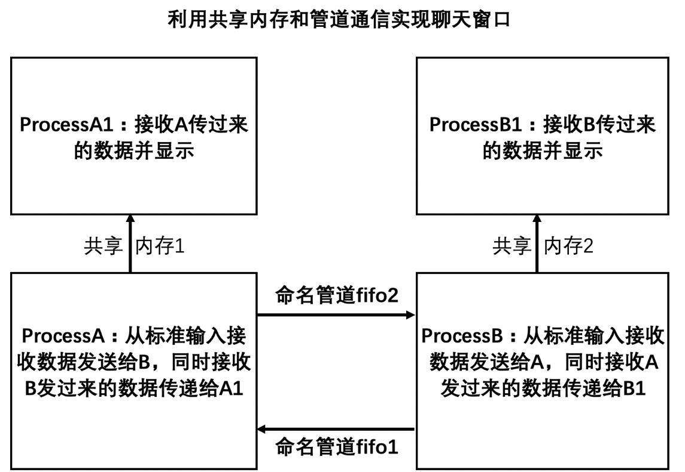
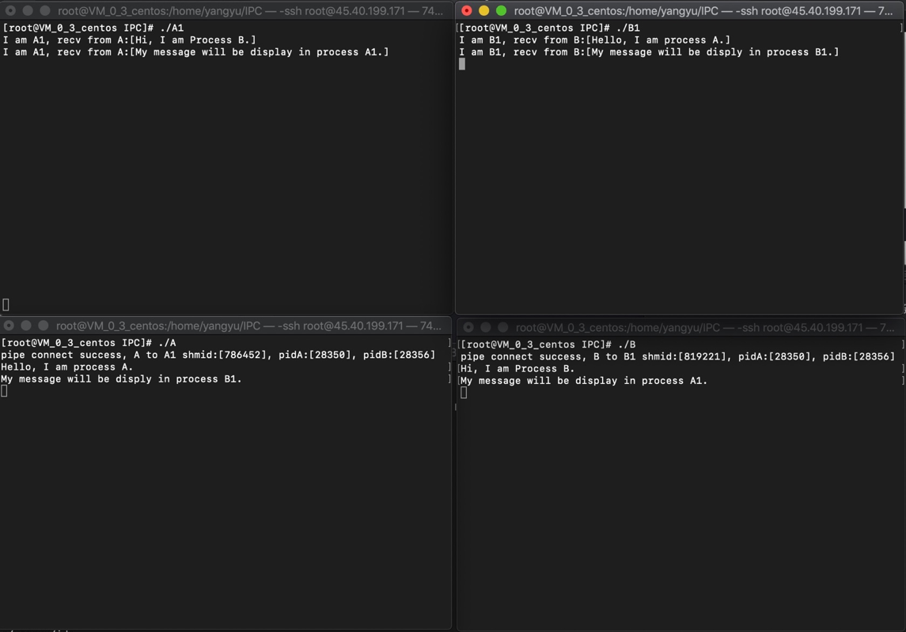
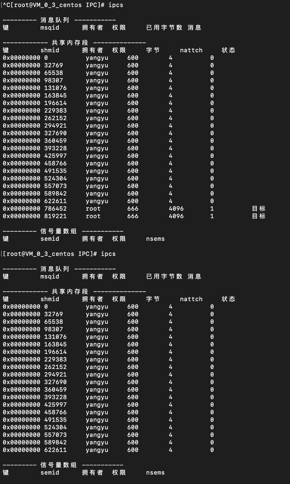

### 问题模型

1. A、B两个进程通过管道通信，A 进程每次接收到的数据通过共享内存传递给A1进程显示，同理，B进程每次接收到的数据通过共享内存传递给B1进程显示；
2. 对于A、B 进程，采用ctrl+c（实际为SIGINT信号）方式退出，A、B进程通过捕捉SIGINT信号注册信号处理函数进行资源清理，A1、B1进程手动关闭即可。


### 特别注意
1. A、B通过管道通信，如果首先通过ctrl+c退出A进程，那么B进程的fifo1管道的写端会收到SIGPIPE信号而终止B进程，因此必须在B进程终止前清理掉被B占用的共享内存2，将共享内存2的引用计数减一，否则，当B1进程退出并清理共享内存2后，共享内存2的引用计数不为0，会导致共享内存2得不到释放；
2. 为了解决前一个问题，A、B进程在启动后立即将各自的进程id通过管道发送给对方，并在各自的进程退出时向对方进程id发送SIGINT信号，触发对方进程进入信号处理接口执行资源回收工作；
2. A和A1通过共享内存1通信，会从A进程和A1进程的虚拟地址空间分配一段连续的页映射到同一块连续的物理内存页上，这样A、A1两个进程都可以间接访问物理内存页，从而达到通信的目的，一般共享内存需要进行保护，读写不能同时进行，也不能同时进行写操作，共享内存省去了从内核缓冲区到用户缓冲区的拷贝，因此效率高。

### 编码与效果图



func.h:
``` bash
#include <stdio.h>
#include <sys/types.h>
#include <fcntl.h>
#include <sys/stat.h>
#include <unistd.h>
#include <errno.h>
#include <strings.h>
#include <string.h>
#include <sys/select.h>
#include <sys/time.h>
#include <stdlib.h>
#include <sys/wait.h>
#include <sys/types.h>
#include <sys/ipc.h>
#include <sys/shm.h>
#include <netinet/in.h>
#include <stdio.h>
#include <sys/socket.h>
#include <arpa/inet.h>
#include <string.h>
#include <netdb.h>
#include <sys/types.h>
#include <sys/select.h>
#include <sys/time.h>
#include <unistd.h>
#include <sys/uio.h>
#include <sys/stat.h>
#include <fcntl.h>
#include <unistd.h>
#include <sys/ipc.h>
#include <sys/shm.h> 
```

processA.cpp：
``` bash
#include "func.h"

int shmid;
int pidB;	// 存放对端进程B的进程id号
char *p;	// 共享内存指针

// 回收共享内存资源前先杀死对端进程，否则回收失败
void handle(int num)
{
	kill(pidB, SIGINT);
	shmdt(p);
	int ret;
	if(-1 == (ret=shmctl(shmid, IPC_RMID, NULL))) 
	{
		perror("shmctl");
		return (void)-1;
	}
	exit(0);
}

int main(int argc, char **argv)
{
	signal(SIGINT, handle);
	if(-1 == (shmid=shmget(1234, 4096, IPC_CREAT|0666)))  
	{
		perror("shmget");
		return -1;
	}
	
	if((char*)-1 == (p=(char*)shmat(shmid, NULL, 0)))
	{
		perror("shmat");
		return -1;
	}
	
	// 管道文件为单工通信方式，因此需要建立两条管道
	// A进程通过管道文件fifo1的读端fdr读取B进程发送的数据
	// A进程通过管道文件fifo2的写端fdw向B进程发送数据
	int fdr, fdw;
	if(-1 == (fdr=open("fifo1", O_RDONLY)) || -1 == (fdw=open("fifo2", O_WRONLY)))
	{
		perror("open fifo1 or open fifo2");
		return -1;
	}
	
	// 通信之前先通过管道互相告知对方自己的进程id
	char s1[10] = {0};
	char s2[10] = {0};
	sprintf(s1, "%d\n", getpid());
	write(fdw, s1, strlen(s1) - 1);
	read(fdr, s2, strlen(s1) - 1);
	pidB = atoi(s2);
	printf("pipe connect success, A to A1 shmid:[%d], pidA:[%d], pidB:[%d]\n", shmid, getpid(), pidB);
	
	char buf[1024] = {0};
	int ret;
	fd_set rdset;
	while(true)
	{
		FD_ZERO(&rdset);
		FD_SET(0, &rdset);
		FD_SET(fdr, &rdset);
		if((ret=select(fdr+1, &rdset, NULL, NULL, NULL) > 0))
		{
			// fdr可读,则接收数据之后通过共享内存传给A1
			if(FD_ISSET(fdr, &rdset))
			{
				bzero(buf, sizeof(buf));
				if(read(fdr, buf, sizeof(buf)) > 0)
				{
					strncpy(p, buf, sizeof(buf));
				}
				else
				{
					break;
				}
			}
			
			// 标准输入可读,读出来传递给B进程
			if(FD_ISSET(0, &rdset))
			{
				bzero(buf, sizeof(buf));
				if(read(STDIN_FILENO, buf, sizeof(buf)) > 0)
				{
					write(fdw, buf, strlen(buf) - 1);
				}
				else
				{
					break;
				}
			}
		}
	}
	
	close(fdr);
	close(fdw);
	return 0;
}
```

processB.cpp：
``` bash
#include "func.h"

int shmid;
int pidA;	// 存放对端进程id
char *p;	// 共享内存指针

// 回收共享内存资源前先杀死对端进程，否则回收失败
void handle(int num)
{
	kill(pidA, SIGINT);
	shmdt(p);
	int ret;
	if(-1 == (ret=shmctl(shmid, IPC_RMID, NULL))) 
	{
		perror("shmctl");
		return (void)-1;
	}
	exit(0);
}

int main(int argc, char **argv)
{
	signal(SIGINT, handle);
	if(-1 == (shmid=shmget(1235, 4096, IPC_CREAT|0666)))
	{
		perror("shmget");
		return -1;
	}
	
	if((char*)-1 == (p=(char*)shmat(shmid, NULL, 0)))
	{
		perror("shmat");
		return -1;
	}
	
	// 管道文件为单工通信方式
	// B进程通过管道文件fifo1的写端fdw向A进程发送数据
	// B进程通过管道文件fifo2的读端fdr接收A进程的数据
	int fdr, fdw;
	if(-1 == (fdw=open("fifo1", O_WRONLY)) || -1 == (fdr=open("fifo2", O_RDONLY)))
	{
		perror("open fifo1 or open fifo2");
		return -1;
	}
	
	// 通信之前先通过管道互相告知对方自己的进程id
	char s1[10] = {0};
	char s2[10] = {0};
	sprintf(s1, "%d\n", getpid());
	write(fdw, s1, strlen(s1) - 1);
	read(fdr, s2, strlen(s1) - 1);
	pidA = atoi(s2);
	printf("pipe connect success, B to B1 shmid:[%d], pidA:[%d], pidB:[%d]\n", shmid, pidA, getpid());
	
	char buf[1024] = {0};
	int ret;
	fd_set rdset;
	while(true)
	{
		FD_ZERO(&rdset);
		FD_SET(0, &rdset);
		FD_SET(fdr, &rdset);
		if((ret=select(fdr+1, &rdset, NULL, NULL, NULL) > 0))
		{
			// fdr可读,则接收数据之后通过共享内存传给B1
			if(FD_ISSET(fdr, &rdset))
			{
				bzero(buf, sizeof(buf));
				if(read(fdr, buf, sizeof(buf)) > 0)
				{
					strncpy(p, buf, sizeof(buf));
				}
				else
				{
					break;
				}
			}
			
			// 标注输入可读,读出来传递给A进程
			if(FD_ISSET(0, &rdset))
			{
				bzero(buf, sizeof(buf));
				if(read(STDIN_FILENO, buf, sizeof(buf)) > 0)
				{
					write(fdw, buf, strlen(buf) - 1);
				}
				else
				{
					break;
				}
			}
		}
	}
	
	close(fdr);
	close(fdw);
	return 0;
}
```

processA1.cpp：
``` bash
#include "fuprintf("p:%s\n", p);nc.h"

int main(void)
{
	char buf[1024] = {0};
	int shmid;
	if(-1 == (shmid=shmget(1234, 4096, IPC_CREAT|0666)))
	{
		perror("shmget");
		return -1;
	}
	
	char *p;
	if((char*)-1 == (p=(char*)shmat(shmid, NULL, 0)))
	{
		perror("shmat");
		return -1;
	}
	
	while(true)
	{
		if(!(strcmp(buf, p)))
		{
			continue;
		}
		else
		{
			// 共享内存有数据可读
			bzero(buf, sizeof(buf));
			strcpy(buf, p);
			printf("I am A1, recv from A:[%s]\n", buf);
		}
	}
	
	if(-1 ==(shmctl(shmid, IPC_RMID, 0)))
	{
		perror("shmctl");
		return -1;
	}
	
	return 0;
}
```

processB1.cpp：
``` bash
#include "func.h"

int main(void)
{
	char buf[1024] = {0};
	int shmid;
	if(-1 == (shmid=shmget(1235, 4096, IPC_CREAT|0666)))
	{
		perror("shmget");
		return -1;
	}
	
	char *p;
	if((char*)-1 == (p=(char*)shmat(shmid, NULL, 0)))
	{
		perror("shmat");
		return -1;
	}
	
	while(true)
	{
		if(!(strcmp(buf, p)))
		{
			continue;
		}
		else
		{
			// 共享内存有数据可读
			bzero(buf, sizeof(buf));
			strcpy(buf, p);
			printf("I am B1, recv from B:[%s]\n", buf);
		}
	}
	
	if(-1 ==(shmctl(shmid, IPC_RMID, 0)))
	{
		perror("shmctl");
		return -1;
	}
	
	return 0;
}
```

### 回收资源

1. 这里首先通过ctrl+c退出A进程，然后B进程收到SIGPIPE信号退出，A、B进程同时调用各自的信号处理函数回收资源，通过ipcs命令发现拥有者为root的共享内存资源的nattch都为1，分别被A1和B1占有。
2. 然后手动关闭A1、B1进程，再次执行ipcs命令，发现拥有者为root的共享内存资源不存在，已经释放成功。
``` bash
$ ipcs  # 查看共性内存资源数量
```


### 源码获取

本文所有[源码链接](https://github.com/icoty/Linux/tree/master/IPC/chat)