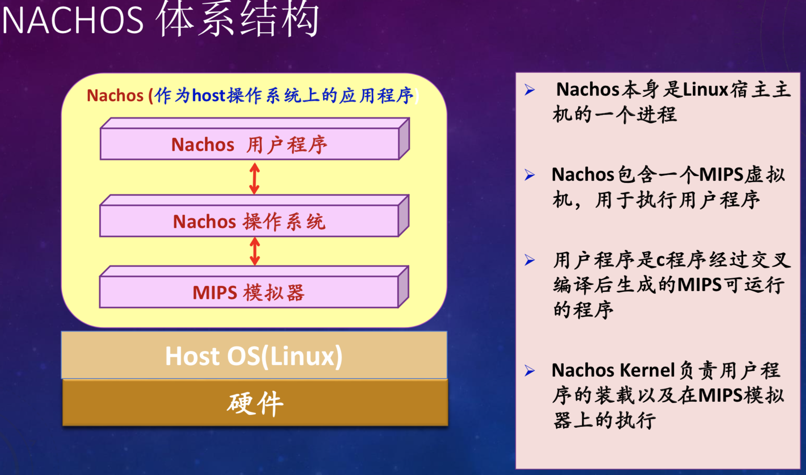
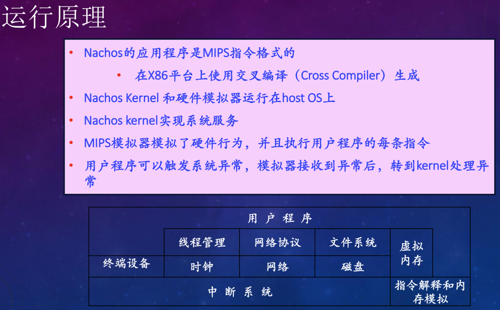
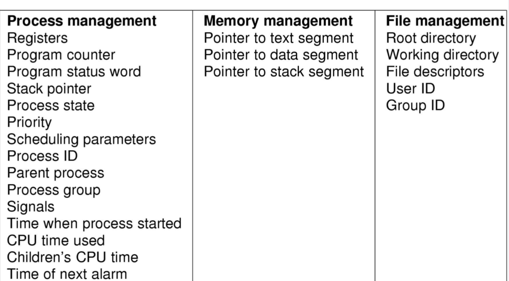

## Nachos是什么

Nachos (Not Another Completely Heuristic Operating System)，是一个教学用操作系统，提供了操作系统框架： 
  1. 线程
  2. 中断
  3. 虚拟内存（位图管理所有物理页，虚拟地址与物理地址之间的转换等）
  4. 同步与互斥机制（锁、条件变量、信号量），读者写者问题，生产者消费者问题，BARRIER问题等
  5. 线程调度（基于优先级可抢占式调度，时间片轮转算法，FIFO调度）
  6. 文件系统
  7. 系统调用
  8. 机器指令、汇编指令、寄存器
	……
	Nachos模拟了一个MIPS模拟器，运行用户程序。





## 目录结构

```bash
.
├── COPYRIGHT
├── gnu-decstation-ultrix	// 交叉编译工具链
├── nachos-3.4.zip	// 未经任何修改的源码和交叉编译工具，实验就是修改源码完善各个模块的功能
├── README
└── nachos-3.4	// 实验过程中完善的代码
  ├── test	// 该目录下编写用户自己的程序，需要修改Makfile添加自己的文件
  ├── bin	// 用户自己的程序需要利用coff2noff转换，才能在nachos下跑起来
  ├── filesys	// 文件系统管理
  │   ├── directory.cc	// 目录文件，由目录项组成，目录项里记录了文件头所在扇区号
  │   ├── directory.h
  │   ├── filehdr.cc
  │   ├── filehdr.h	// 文件头数据结构，通过索引记录了文件内容实际存储的所有扇区号
  │   ├── filesys.cc	// 文件系统数据结构，创建/删除/读/写/修改/重命名/打开/关别等接口
  │   ├── filesys.h
  │   ├── fstest.cc
  │   ├── Makefile
  │   ├── openfile.cc	// 管理所有打开的文件句柄
  │   ├── openfile.h
  │   ├── synchdisk.cc	// 同步磁盘类，加锁保证互斥和文件系统的一致性
  │   ├── synchdisk.h
  │   └── test
  ├── machine	// 机器硬件模拟
  │   ├── console.cc	// 终端
  │   ├── console.h
  │   ├── disk.cc	// 磁盘
  │   ├── disk.h
  │   ├── interrupt.cc	// 中断处理器，利用FIFO维护一个中断队列
  │   ├── interrupt.h
  │   ├── timer.cc	// 模拟硬件时钟，用于时钟中断
  │   ├── timer.h
  │   ├── translate.cc	// 用户程序空间虚拟地址和物理之间的转换类
  │   └── translate.h
  ├── network	// 网络系统管理
  │   ├── Makefile
  │   ├── nettest.cc
  │   ├── post.cc
  │   ├── post.h
  │   └── README
  ├── threads	// 内核线程管理
  │   ├── list.cc	// 工具模块 定义了链表结构及其操作
  │   ├── list.h
  │   ├── main.cc	// main入口，可以传入argv参数
  │   ├── Makefile
  │   ├── scheduler.cc	// 调度器，维护一个就绪的线程队列，时间片轮转/FIFO/优先级抢占
  │   ├── scheduler.h
  │   ├── stdarg.h
  │   ├── switch.c	// 线程启动和调度模块
  │   ├── switch.h
  │   ├── switch-old.s
  │   ├── switch.s	// 线程切换
  │   ├── synch.cc	// 同步与互斥，锁/信号量/条件变量
  │   ├── synch.dis
  │   ├── synch.h
  │   ├── synchlist.cc	// 类似于一个消息队列
  │   ├── synchlist.h
  │   ├── system.cc	// 主控模块
  │   ├── system.h
  │   ├── thread.cc	// 线程数据结构
  │   ├── thread.h
  │   ├── threadtest.cc	
  │   ├── utility.cc
  │   └── utility.h
  ├── userprog	// 用户进程管理
  │   ├── addrspace.cc	// 为noff文件的代码段/数据段分配空间，虚拟地址空间
  │   ├── addrspace.h
  │   ├── bitmap.cc	// 位图，用于管理扇区的分配和物理地址的分配
  │   ├── bitmap.h
  │   ├── exception.cc	// 异常处理
  │   ├── Makefile
  │   ├── progtest.cc	// 测试nachos是否可执行用户程序
  │   └── syscall.h	// 系统调用
  └── vm	// 虚拟内存管理
  └── Makefile	// 多线程编译: make -j4
  └── Makefile.common	// 各个模块公共的Makefile内容存放到这里面
  └── Makefile.dep	// 依赖
```

## 环境
选择Linux或Unix系统，安装32位GCC开发环境，安装32的ubuntu。

## 源码获取
https://github.com/icoty/nachos-3.4-Lab

## 内容一：总体概述

本次Lab针对的内容是实现线程机制最基本的数据结构——进程控制块（PCB）。当一个进程创建时必然会生成一个相应的进程控制块，记录一些该线程特征，如进程ID、进程状态、进程优先级，进程开始运行时间，在cpu上已经运行了多少时间，程序计数器，SP指针，根目录和当前目录指针，文件描述符表，用户ID，组ID，指向代码段、数据段和栈段的指针等（当然，Nachos简化了进程控制块的内容）。实验的主要内容是修改和扩充PCB，主要难点在于发现修改PCB影响到的文件并进行修改。PCB是系统感知进程存在的唯一标志，且进程与PCB一一对应。可将PCB内部信息划分为：进程描述信息，进程控制信息，进程占有的资源和使用情况，进程的cpu现场。扩展字段如下：



## 内容二：任务完成情况

### 任务完成列表（Y/N）

|          | Exercise1 | Exercise2 | Exercise3 | Exercise4 |
| -------- | --------- | --------- | --------- | --------- |
| 第一部分  | Y         | Y         | Y         | Y         |


### 具体Exercise的完成情况

#### Exercise1  调研

调研Linux或Windows中进程控制块（PCB）的基本实现方式，理解与Nachos的异同。

**linux-4.19.23调研**：Linux中的每一个进程由一个task_struct数据结构来描述。task_struct也就是PCB的数据结构。task_struct容纳了一个进程的所有信息，linux内核代码中的task_struct在linux-4.19.23/include/linux/sched.h内。

**Linux内核进程状态**：如下可分为运行态，可中断和不可中断态，暂停态，终止态，僵死状态，挂起状态等。

**Linux内核进程调度**：sched_info数据结构，包括被调度次数，等待时间，最后一次调度时间。
**vi linux-4.19.23/include/linux/sched.h**：

``` bash
……
/* Used in tsk->state: */
#define TASK_RUNNING			0x0000	// 运行态
#define TASK_INTERRUPTIBLE		0x0001	// 可中断
#define TASK_UNINTERRUPTIBLE		0x0002	// 不可中断
#define __TASK_STOPPED			0x0004	
#define __TASK_TRACED			0x0008
/* Used in tsk->exit_state: */
#define EXIT_DEAD			0x0010
#define EXIT_ZOMBIE			0x0020	// 僵死态
#define EXIT_TRACE			(EXIT_ZOMBIE | EXIT_DEAD)
/* Used in tsk->state again: */
#define TASK_PARKED			0x0040
#define TASK_DEAD			0x0080
#define TASK_WAKEKILL			0x0100
#define TASK_WAKING			0x0200
#define TASK_NOLOAD			0x0400
#define TASK_NEW			0x0800
#define TASK_STATE_MAX			0x1000
……
……
struct sched_info {
#ifdef CONFIG_SCHED_INFO
	/* Cumulative counters: */

	/* # of times we have run on this CPU: */
	unsigned long			pcount;

	/* Time spent waiting on a runqueue: */
	unsigned long long		run_delay;

	/* Timestamps: */

	/* When did we last run on a CPU? */
	unsigned long long		last_arrival;

	/* When were we last queued to run? */
	unsigned long long		last_queued;

#endif /* CONFIG_SCHED_INFO */
};
……
```

**时钟与锁**：内核需要记录进程在其生存期内使用CPU的时间以便于统计、计费等有关操作。进程耗费CPU的时间由两部分组成：一是在用户态下耗费的时间，一是在系统态下耗费的时间。这类信息还包括进程剩余的时间片和定时器信息等，以控制相应事件的触发。

**文件系统信息**：进程可以打开或关闭文件，文件属于系统资源，Linux内核要对进程使用文件的情况进行记录。

**虚拟内存信息**：除了内核线程，每个进程都拥有自己的地址空间，Linux内核中用mm_struct结构来描述。

**物理页管理信息**：当物理内存不足时，Linux内存管理子系统需要把内存中部分页面交换到外存，并将产生PageFault的地址所在的页面调入内存，交换以页为单位。这部分结构记录了交换所用到的信息。

**多处理器信息**：与多处理器相关的几个域，每个处理器都维护了自己的一个进程调度队列，Linux内核中没有线程的概念，统一视为进程。

**处理器上下文信息**：当进程因等待某种资源而被挂起或停止运行时，处理机的状态必须保存在进程的task_struct，目的就是保存进程的当前上下文。当进程被调度重新运行时再从进程的task_struct中把上下文信息读入CPU（实际是恢复这些寄存器和堆栈的值），然后开始执行。

**与Nachos的异同**：Nachos相对于Linux系统的线程部分来讲，要简单许多。它的PCB仅有几个必须的变量，并且定义了一些最基本的对线程操作的函数。Nachos线程的总数目没有限制，线程的调度比较简单，而且没有实现线程的父子关系。很多地方需要完善。

#### Exercise2 源代码阅读

**code/threads/main.cc**：main.cc是整个nachos操作系统启动的入口，通过它可以直接调用操作系统的方法。通过程序中的main函数，配以不同的参数，可以调用Nachos操作系统不同部分的各个方法。 

**code/threads/threadtest.cc**：nachos内核线程测试部分，Fork两个线程，交替调用Yield()主动放弃CPU，执行循环体，会发现线程0和线程1刚好是交替执行。

``` bash
int main(int argc, char **argv)
{
  int argCount;			// the number of arguments 
  DEBUG('t', "Entering main");
  (void) Initialize(argc, argv);
#ifdef THREADS
  for (argc--, argv++; argc > 0; argc -= argCount, argv += argCount) {
    argCount = 1;
    switch (argv[0][1]) {
      case 'q':
        testnum = atoi(argv[1]);
        argCount++;
        break;
      case 'T':
        if(argv[0][2] == 'S')
        testnum = 3;
        break;
      default:
        testnum = 1;
        break;
    }
  }
  ThreadTest();
#endif
	……
}

threadtest.cc
// 线程主动让出cpu,在FIFO调度策略下能够看到多个线程按顺序运行
void SimpleThread(int which)
{
  for (int num = 0; num < 5; num++) {
    int ticks = stats->systemTicks - scheduler->getLastSwitchTick();
    // 针对nachos内核线程的时间片轮转算法，判断时间片是否用完，如果用完主动让出cpu
    if(ticks >= TimerSlice){
    	currentThread->Yield();
    }
    
    // 多个线程同时执行该接口的话，会交替执行，交替让出cpu
    // currentThread->Yield();
  }
}

root@yangyu-ubuntu-32:/mnt/nachos-3.4/code/threads# 
root@yangyu-ubuntu-32:/mnt/nachos-3.4/code/threads# ./nachos -q 1
userId=0,threadId=0,prio=5,loop:0,lastSwitchTick=0,systemTicks=20,usedTicks=20,TimerSlice=30
userId=0,threadId=1,prio=5,loop:0,lastSwitchTick=20,systemTicks=30,usedTicks=10,TimerSlice=30
userId=0,threadId=0,prio=5,loop:1,lastSwitchTick=30,systemTicks=40,usedTicks=10,TimerSlice=30
userId=0,threadId=1,prio=5,loop:1,lastSwitchTick=40,systemTicks=50,usedTicks=10,TimerSlice=30
userId=0,threadId=0,prio=5,loop:2,lastSwitchTick=50,systemTicks=60,usedTicks=10,TimerSlice=30
userId=0,threadId=1,prio=5,loop:2,lastSwitchTick=60,systemTicks=70,usedTicks=10,TimerSlice=30
userId=0,threadId=0,prio=5,loop:3,lastSwitchTick=70,systemTicks=80,usedTicks=10,TimerSlice=30
userId=0,threadId=1,prio=5,loop:3,lastSwitchTick=80,systemTicks=90,usedTicks=10,TimerSlice=30
userId=0,threadId=0,prio=5,loop:4,lastSwitchTick=90,systemTicks=100,usedTicks=10,TimerSlice=30
userId=0,threadId=1,prio=5,loop:4,lastSwitchTick=100,systemTicks=110,usedTicks=10,TimerSlice=30
No threads ready or runnable, and no pending interrupts.
Assuming the program completed.
Machine halting!

Ticks: total 130, idle 0, system 130, user 0
Disk I/O: reads 0, writes 0
Console I/O: reads 0, writes 0
Paging: faults 0
Network I/O: packets received 0, sent 0

Cleaning up...
```

**code/threads/thread.h**：这部分定义了管理Thread的数据结构，即Nachos中线程的上下文环境。主要包括当前线程栈顶指针，所有寄存器的状态，栈底，线程状态，线程名。当前栈指针和机器状态的定义必须必须放作为线程成员变量的前两个，因为Nachos执行线程切换时，会按照这个顺序找到线程的起始位置，然后操作线程上下文内存和寄存器。在Thread类中还声明了一些基本的方法，如Fork()、Yield()、Sleep()等等，由于这些方法的作用根据名字已经显而易见了，在此不再赘述。 

**code/threads/thread.cc**： Thread.cc中主要是管理Thread的一些事务。主要接口如下：

- Fork(VoidFunctionPtr func,int arg)：func是新线程运行的函数，arg是func函数的入参，Fork的实现包括分为几步：分配一个堆栈，初始化堆栈，将线程放入就绪队列。
- Finish()：不是直接收回线程的数据结构和堆栈，因为当前仍在这个堆栈上运行这个线程。先将threadToBeDestroyed的值设为当前线程，在Scheduler的Run()内切换到新的线程时在销毁threadToBeDestroyed。Yield()、Sleep()。这里实现的方法大多是都是原子操作，在方法的一开始保存中断层次关闭中断，并在最后恢复原状态。
- Yield()：当前线程放入就绪队列，从scheduler就绪队列中的找到下一个线程上cpu，以达到放弃CPU的效果。

#### Exercise3 扩展线程的数据结构
#### Exercise4 增加全局线程管理机制
这里我把Exercise3和Exercise4放在一起完成。

- 在Thread类中添加私有成员userId和threadId，添加公有接口getUserId()和getThreadId()，userId直接沿用Linux个getuid()接口。

- system.h内部添加全局变量maxThreadsCount=128，全局数组threads[maxThreadsCount]，每创建一个线程判断并分配threadId。

- **-TS**模仿Linux的PS命令打印所有线程信息，仔细阅读list.cc代码和scheduler.cc的代码，就会发现可以直接用scheduler.cc::Print()接口，不用我们重新造轮子。

- 在system.cc中的void Initialize(**int** argc, **char** argv)函数体对全局数组初始化。如下我用root用户执行分配的userId为0，切换到其他用户userId会发生变化，线程id分别为0和1。当线程数超过128个线程时，ASSERT断言报错。

``` bash
threadtest.cc：
void ThreadTest()
{
  switch (testnum) {
    case 1:
    ThreadTest1();
    break;
  case 2:
    ThreadCountLimitTest();
    break;
  case 3:
    ThreadPriorityTest();
    break;
  case 4:
    ThreadProducerConsumerTest();
    break;
  case 5:
    ThreadProducerConsumerTest1();
    break;
  case 6:
    barrierThreadTest();
    break;
  case 7:
    readWriteThreadTest();
    break;
  default:
    printf("No test specified.\n");
    break;
  }
}

// 线程最多128个，超过128个终止运行
void ThreadCountLimitTest()
{
  for (int i = 0; i <= maxThreadsCount; ++i) {
    Thread* t = new Thread("fork thread");
    printf("thread name = %s, userId = %d, threadId = %d\n", t->getName(), t->getUserId(), t->getThreadId());
  }
}

root@yangyu-ubuntu-32:/mnt/nachos-3.4/code/threads# ./nachos -TS
thread name = fork thread, userId = 0, threadId = 1
thread name = fork thread, userId = 0, threadId = 2
thread name = fork thread, userId = 0, threadId = 3
……
thread name = fork thread, userId = 0, threadId = 122
thread name = fork thread, userId = 0, threadId = 123
thread name = fork thread, userId = 0, threadId = 124
thread name = fork thread, userId = 0, threadId = 125
thread name = fork thread, userId = 0, threadId = 126
thread name = fork thread, userId = 0, threadId = 127
allocatedThreadID fail, maxThreadsCount:[128]
Assertion failed: line 73, file "../threads/thread.cc"
Aborted (core dumped)
root@yangyu-ubuntu-32:/mnt/nachos-3.4/code/threads# 
```

## 内容三：遇到的困难以及解决方法

### 困难1

开始make编译出错，通过定位到具体行，复制出来手动执行，发现是gcc交叉编译工具链路径不对。

### 困难2

刚开始修改代码验证效果，重定义错误，外部文件全局变量使用方式不对导致。

## 内容四：收获及感想

动手实践很重要，不管你是做什么事、什么项目、什么作业，一定要落实到代码和跑到程序上面来。绝知此事要躬行，学习来不得半点虚假。

## 内容五：对课程的意见和建议

暂无。

## 内容六：参考文献

暂无。