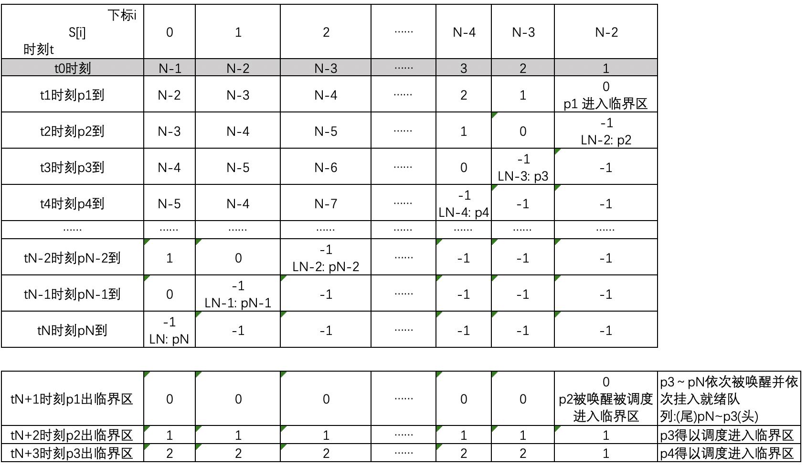

### 问题模型

有一个系统，定义如下P、V操作：
``` bash
P(s)：
	s.count--;
	if s<0 then
		将本进程插入相应队列末尾等待;
  	
V(s):
	s.count++;
	if s<=0 then
		从相应等待队列队尾唤醒一个进程，将其插入就绪队列; 
```
思考并回答:
a. 这样定义P、V操作是否有问题?
b. 试用这样的P、V操作实现N个进程竞争使用某一共享变量的互斥机制。
c. 对于b的解法，有无效率更高的方法。如有，试问降低了多少复杂性?

### 分析

a. 当然有问题，假设s=2，现有进程p1、p2按顺序来请求共享资源A，p1和p2直接获取A，假设p1和p2都还未释放A的时候，p3、p4、p5按顺序也来请求A，这时s的等待队列L为：(尾)p5p4p3(头)，然后p1释放A，执行V(s)操作从L队尾唤醒p5，L变为：(尾)p4p3(头)。这时A被p2和p5持有，且p2和p5都未释放A的时候，假设这时p1又来请求A，p1被挂起，L变为：(尾)p1p4p3(头)。然后p2释放A执行V(s)操作从L队尾唤醒p1，你会发现p1又竞争到了A，而p3和p4还一次都未竞争到，这会导致越靠近L队首的p3和p4越容易饿死，出现饥饿现象。问题的根源就在于这样定义的P、V操作，由于在信号量的等待队列上是先进后出导致的，这属于栈P、V。

b. 解决方案
这里以N个进程为例进行一般化分析，定义信号量数组S[N-1]，共有N-1个信号量，下标从0～N-2，其中S[i] = N-i-1，表示第i+1个信号量S[i]的初值为N-i-1，初值为何取这个看后面分析，下为伪码。

``` bash
Semaphore S[N-1];	// S[i] = N-i-1
void func()
{
	for(int i=0 ; i<n-1 ; i++)
		P(S[i]);
	// 临界区 Critical Section
	for(int i=n-2 ; i>=0 ; i--)
		V(S[i]);
}
```

一定要注意P(S[i])操作中的i是从0～N-2，而V(S[i])的i是反过来的从N-2～0，这个很重要，这个就是多级队列的精髓，顺序不能换。
下面的分析，假设t1时刻p1进入临界区还没出来之前，t2～tN时刻p2～pN按顺序来请求进入临界区，那么p2～pN都执行for循环，分别被挂起在信号量N-2～0的等待队列上，并且每个信号量的等待队列上有且只有一个进程被挂起。在tN+1时刻p1出临界区，由于V(S[i])是从N-2～0，因此等待在LN-2上的P2最先被唤醒，然后L2进入临界区。之后按顺序p3～pN依次被唤醒并依次挂入就绪队列等待被调度，而处理器从就绪队列进行调度是FIFO，与请求临界区的顺序一致，饥饿现象得以解决。



该方法的资源复杂度为O(N-1)，需要N-1个信号量。

c. 优化方法
除了前面的办法，已经可以确定存在更优方案能把资源复杂度降为O(logN)。

