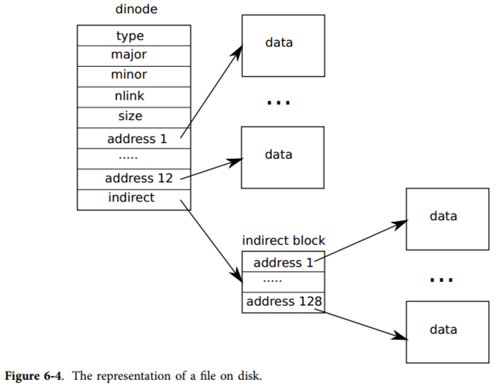

## Exercise1 源代码阅读

文件系统部分 buf.h fcntl.h stat.h fs.h file.h ide.c bio.c log.c fs.c file.c sysfile.c exec.c
1. buf.h：对xv6中磁盘块数据结构进行定义，块大小为512字节。

```bash
// xv6中磁盘块数据结构,块大小512字节
struct buf {
  int flags; // DIRTY, VALID
  uint dev;
  uint sector; // 对应扇区
  struct buf *prev; // LRU cache list
  struct buf *next; // 链式结构用于连接
  struct buf *qnext; // disk queue
  uchar data[512];
};
#define B_BUSY  0x1  // buffer is locked by some process
#define B_VALID 0x2  // buffer has been read from disk
#define B_DIRTY 0x4  // buffer needs to be written to disk
```
2. fcntl.h：宏定义操作权限。

```bash
#define O_RDONLY  0x000 // 只读
#define O_WRONLY  0x001 // 只写
#define O_RDWR    0x002 // 读写
#define O_CREATE  0x200 // 创建
```
3. stat.h：声明文件或目录属性数据结构。

```bash
#define T_DIR  1   // Directory
#define T_FILE 2   // File
#define T_DEV  3   // Device

struct stat {
  short type;  // Type of file
  int dev;     // File system's disk device
  uint ino;    // Inode number
  short nlink; // Number of links to file
  uint size;   // Size of file in bytes
};
```

4. fs.h / fs.c：声明超级块、dinode、文件和目录数据结构，以及相关的宏定义。

```bash
#define ROOTINO 1  // root i-number
#define BSIZE 512  // block size

// File system super block
struct superblock {
  uint size;         // Size of file system image (blocks)
  uint nblocks;      // Number of data blocks
  uint ninodes;      // Number of inodes.
  uint nlog;         // Number of log blocks
};

#define NDIRECT 12
#define NINDIRECT (BSIZE / sizeof(uint))
#define MAXFILE (NDIRECT + NINDIRECT)

// 磁盘上inode节点体现形式
// On-disk inode structure
struct dinode {
  short type;           // File type
  short major;          // Major device number (T_DEV only)
  short minor;          // Minor device number (T_DEV only)
  short nlink;          // Number of links to inode in file system
  uint size;            // Size of file (bytes)
  uint addrs[NDIRECT+1];   // Data block addresses
};

// Inodes per block.
#define IPB           (BSIZE / sizeof(struct dinode))

// Block containing inode i
#define IBLOCK(i)     ((i) / IPB + 2)

// Bitmap bits per block
#define BPB           (BSIZE*8)

// Block containing bit for block b
#define BBLOCK(b, ninodes) (b/BPB + (ninodes)/IPB + 3)

// Directory is a file containing a sequence of dirent structures.
#define DIRSIZ 14

// 文件或目录据结构，目录本身是以文件的方式存储到磁盘上的，叫做目录文件。
struct dirent {
  ushort inum; // i节点
  char name[DIRSIZ]; // 文件或目录名
};
```
5. file.h：声明inode、file数据结构。

```bash
struct file {
  // 分为管道文件,设备文件,普通文件
  enum { FD_NONE, FD_PIPE, FD_INODE } type; 
  int ref; // reference count
  char readable;
  char writable;
  struct pipe *pipe;
  struct inode *ip; // 指向inode节点
  uint off;
};

// 在内存中inode节点体现形式
// in-memory copy of an inode
struct inode {
  uint dev;           // Device number
  uint inum;          // Inode number
  int ref;            // Reference count
  int flags;          // I_BUSY, I_VALID

	  // 下面这些编程都是dinode的拷贝
	  // copy of disk inode
  short type;         
  short major;
  short minor;
  short nlink;
  uint size;
  uint addrs[NDIRECT+1];
};
#define I_BUSY 0x1
#define I_VALID 0x2

// table mapping major device number to device functions
struct devsw {
  int (*read)(struct inode*, char*, int);
  int (*write)(struct inode*, char*, int);
};

extern struct devsw devsw[];

#define CONSOLE 1
```

6. ide.c：磁盘IO的具体实现，xv6维护了一个进程请求磁盘操作的队列(idequeue)。当进程调用**void iderw(struct buf *b)**请求读写磁盘时，该请求被加入等待队列idequeue，同时进程进入睡眠状态。当一个磁盘读写操作完成时，会触发一个中断，中断处理程序ideintr()会移除队列开头的请求，唤醒队列开头请求所对应的进程。

```bash
// idequeue points to the buf now being read/written to the disk.
// idequeue->qnext points to the next buf to be processed.
// You must hold idelock while manipulating queue.

static struct spinlock idelock; // 保护 idequeue
static struct buf *idequeue; // 磁盘读写操作的请求队列
……
// 等待磁盘进入空闲状态
// Wait for IDE disk to become ready.
static int idewait(int checkerr)
{
  ……
  // 
  while(((r = inb(0x1f7)) & (IDE_BSY|IDE_DRDY)) != IDE_DRDY);
  ……
}

// 初始化IDE磁盘IO
void ideinit(void)
{
  ……
}

// 开始一个磁盘读写请求
// Start the request for b.  Caller must hold idelock.
static void idestart(struct buf *b)
{
  ……
}

// 当磁盘请求完成后中断处理程序会调用的函数
// Interrupt handler.
void ideintr(void)
{
  …… // 处理完一个磁盘IO请求后，唤醒等待在等待队列头的那个进程
  wakeup(b);
  
  // 如果队列不为空，继续处理下一个磁盘IO任务
  // Start disk on next buf in queue.
  if(idequeue != 0)
    idestart(idequeue);
  ……
}

//PAGEBREAK!  上层文件系统调用的磁盘IO接口
// Sync buf with disk. 
// If B_DIRTY is set, write buf to disk, clear B_DIRTY, set B_VALID.
// Else if B_VALID is not set, read buf from disk, set B_VALID.
void iderw(struct buf *b)
{
  …… // 竞争锁
  acquire(&idelock);  //DOC:acquire-lock

  // Append b to idequeue.
  b->qnext = 0;
  for(pp=&idequeue; *pp; pp=&(*pp)->qnext)  //DOC:insert-queue
    ;
  *pp = b;
  
  // Start disk if necessary.  开始处理一个磁盘IO任务
  if(idequeue == b)
    idestart(b);
  
  // Wait for request to finish.  睡眠等待
  while((b->flags & (B_VALID|B_DIRTY)) != B_VALID){
    sleep(b, &idelock);
  }

  release(&idelock);  // 释放锁
}
```

7. bio.c：Buffer Cache的具体实现。因为读写磁盘操作效率不高，根据时间与空间局部性原理，这里将最近经常访问的磁盘块缓存在内存中。主要接口有struct buf* bread(uint dev, uint sector)、void bwrite(struct buf *b)，bread会首先从缓存中去寻找块是否存在，如果存在直接返回，如果不存在则请求磁盘读操作，读到缓存中后再返回结果。bwrite直接将缓存中的数据写入磁盘。
8. log.c：该模块主要是维护文件系统的一致性。引入log模块后，对于上层文件系统的全部磁盘操作都被切分为transaction，每个transaction都会首先将数据和其对应磁盘号写入磁盘上的log区域，且只有在log区域写入成功后，才将log区域的数据写入真正存储的数据块。因此，如果在写log的时候宕机，重启后文件系统视为该log区的写入不存在，如果从log区写到真实区域的时候宕机，则可根据log区域的数据恢复。
9. sysfile.c：主要定义了与文件相关的系统调用。主要接口及含义如下：

```bash
// Allocate a file descriptor for the given file.
// Takes over file reference from caller on success.
static int fdalloc(struct file *f)
{
  …… // 申请一个未使用的文件句柄
}

int sys_dup(void)
{
  …… // 调用filedup对文件句柄的引用计数+1
  filedup(f);
  return fd;
}

int sys_read(void)
{
  …… // 读取文件数据
  return fileread(f, p, n);
}

int sys_write(void)
{
  …… // 向文件写数据
  return filewrite(f, p, n);
}

int sys_close(void)
{
  …… // 释放文件句柄资源
  fileclose(f);
  return 0;
}

int sys_fstat(void)
{
  …… // 修改文件统计信息
  return filestat(f, st);
}

// Create the path new as a link to the same inode as old.
int sys_link(void)
{
  …… // 为已有的inode创建一个新名字
}

//PAGEBREAK!
int sys_unlink(void)
{
  …… // 解除inode中的某个名字, 若名字全被移除, inode回被释放
}

static struct inode* create(char *path, short type, 
	    short major, short minor)
{
  …… // 
}

int sys_mkdir(void)
{
  …… // 创建一个目录
}

int sys_mknod(void)
{
  …… // 创建一个新文件
}

int sys_chdir(void)
{
  …… // 切换目录
}

int sys_pipe(void)
{
  …… // 创建一个管道文件
}

```
10. exec.c：只有一个exec接口，实质就是传入elf格式的可执行文件，装载到内存并分配内存页，argv是一个指针数组，用于携带参数。

```bash
int exec(char *path, char **argv)
{
  …… // 判断文件是否存在
  if((ip = namei(path)) == 0)
    return -1;
  ilock(ip);
  pgdir = 0;

  // Check ELF header  检查elf头是否合法
  if(readi(ip, (char*)&elf, 0, sizeof(elf)) < sizeof(elf))
    goto bad;
  ……
  
  // Load program into memory.
  sz = 0;
  for(i=0, off=elf.phoff; i<elf.phnum; i++, off+=sizeof(ph)){
    if(readi(ip, (char*)&ph, off, sizeof(ph)) != sizeof(ph))
      goto bad;
    if(ph.type != ELF_PROG_LOAD)
      continue;
    if(ph.memsz < ph.filesz)
      goto bad;
    if((sz = allocuvm(pgdir, sz, ph.vaddr + ph.memsz)) == 0)
      goto bad;
    if(loaduvm(pgdir, (char*)ph.vaddr, ip, ph.off, ph.filesz) < 0)
      goto bad;
  }
  iunlockput(ip);
  ip = 0;

  // Allocate two pages at the next page boundary.
  // Make the first inaccessible.  Use the second as the user stack.
  sz = PGROUNDUP(sz);
  if((sz = allocuvm(pgdir, sz, sz + 2*PGSIZE)) == 0)
    goto bad;
  clearpteu(pgdir, (char*)(sz - 2*PGSIZE));
  sp = sz;

  // Push argument strings, prepare rest of stack in ustack.
  for(argc = 0; argv[argc]; argc++) {
    if(argc >= MAXARG)
      goto bad;
    sp = (sp - (strlen(argv[argc]) + 1)) & ~3;
    if(copyout(pgdir, sp, argv[argc], strlen(argv[argc]) + 1) < 0)
      goto bad;
    ustack[3+argc] = sp;
  }
  ……

 bad:
  if(pgdir)
    freevm(pgdir);
  if(ip)
    iunlockput(ip);
  return -1;
}
```

## Exercise2 带着问题阅读

1. 了解 UNIX 文件系统的主要组成部分：超级块(superblock)，i节点(inode)，数据块(datablock)，目录块(directoryblock)，间接块(indirectionblock)。分别解释它们的作用。

|boot|super block|dinode| free bitmap blocks|data blocks|log blocks|
|:--:|:-------:|:---------:|:---------:|:---------:|:---------:|
|第0块|第1块|superblock.ninodes块|位图管理空闲区块|superblock.nblocks块|superblock.nlog块|

   - bootloader引导区(第0块)：用于存放引导程序，系统启动从这里开始；
   - superblock超级块(第1块)：记录文件系统的元信息，如文件系统的总块数，数据块块数，i节点数，日志的块数；
   - i节点(inode)：从第2块开始存放 i 节点，每一块能够存放多个 i 节点；
   - bitmap空闲块管理区：用于存放空闲块位图，因为系统需要知道文件系统的使用情况，哪些块已经分配出去了，哪些块还未被分配；
   - 数据块 (datablock)：数据块存储的是真真实实的文件内容；
   - 目录块(directoryblock)：文件系统中除了文件外，还有目录，目录本身是一个文件目录(由很多FCB组成)，文件目录也需要以文件的形式存储到磁盘上，存储到磁盘上的这个文件叫做目录文件，目录文件就是存储到目录块中的；
   - 间接块(indirectionblock)：xv6这里应该是指log日志块，这是文件系统执行磁盘IO操作的中间层，主要目的是维护文件系统的一致性。

2. 阅读文件ide.c。这是一个简单的ide硬盘驱动程序，对其内容作大致了解。

- xv6 的文件系统分6层实现，从底至顶如下：

|System calls  |File descriptors|
|:------------:|:--------------:|
|Pathnames     |Recursive lookup|
|Directories   |Directory inodes|
|Files         |Inodes and block allocator|
|Transactions  |Logging         |
|Blocks        |Buffer cache    |

- 底层通过块缓冲Buffer cache读写IDE 硬盘，它同步了对磁盘的访问，保证同时只有一个内核进程可以修改磁盘块；
- 第二层Loggins向上层提供服务，该层实现了文件系统的一致性，使得更高层的接口可以将对磁盘的更新按会话打包，通过会话的方式来保证这些操作是原子操作(要么都被应用，要么都不被应用)；
- 第三层提供无名文件，每一个这样的文件由一个 i 节点和一连串的数据块组成；
- 第四层将目录实现为一种特殊的 i 节点，它的内容是一连串的目录项，每一个目录项包含一个文件名和对应的 i 节点；
- 第五层提供了层次路经名（如/usr/rtm/xv6/fs.c这样的），这一层通过递归的方式来查询路径对应的文件；
- 最后一层将许多 UNIX 的资源（如管道，设备，文件等）抽象为文件系统的接口，极大地简化了程序员的工作。

3. 阅读文件buf.h，bio.c。了解 XV6 文件系统中buffer cache层的内容和实现。描述buffer双链表数据结构及其初始化过程。了解 buffer的状态。了解对buffer的各种操作。

- 数据结构bcache维护了一个由struct buf组成的双向链表，同时bcache.lock用户互斥访问；
- 首先系统调用binit()初始化缓存，随即调用initlock初始化bcache.lock，然后循环遍历buf数组，采用头插法逐个链接到bcache.head后；
- 上层文件系统读磁盘时，调用bread()，随即调用bget()检查请求的磁盘块是否在缓存中，如果命中，返回缓存命中结果。如果未命中，转到底层的iderw()函数先将此磁盘块从磁盘加载进缓存中，再返回此磁盘块；
- 上层文件系统写磁盘时，调用bwrite()直接将缓存中的数据写入磁盘。Buffer Cache层不会尝试执行任何延迟写入的操作，何时调用bwrite()写入磁盘是由上层的文件系统控制的；
- 上层文件系统可通过调用brelse()释放一块不再使用的缓冲区。
```bash
// buf.h
struct buf {
  int flags;
  uint dev;
  uint sector;
  struct buf *prev; // LRU cache list
  struct buf *next;
  struct buf *qnext; // disk queue
  uchar data[512];
};

// bio.c
struct {
  struct spinlock lock;
  struct buf buf[NBUF];

  // Linked list of all buffers, through prev/next.
  // head.next is most recently used.
  struct buf head;
} bcache;

void binit(void)
{
  struct buf *b;

  initlock(&bcache.lock, "bcache");

  //PAGEBREAK!  头插法,每次都是插入到bcache.head的后面
  // Create linked list of buffers
  bcache.head.prev = &bcache.head;
  bcache.head.next = &bcache.head;
  for(b = bcache.buf; b < bcache.buf+NBUF; b++){
    b->next = bcache.head.next;
    b->prev = &bcache.head;
    b->dev = -1;
    bcache.head.next->prev = b;
    bcache.head.next = b;
  }
}

// Return a B_BUSY buf with the contents of the indicated disk sector.
struct buf* bread(uint dev, uint sector)
{
  struct buf *b;
  // 优先查找缓存
  b = bget(dev, sector);
  if(!(b->flags & B_VALID))
    iderw(b);  // 命中失败时调用下一次接口真真实实读磁盘
  return b;
}

// Write b's contents to disk.  Must be B_BUSY.
void bwrite(struct buf *b)
{
  if((b->flags & B_BUSY) == 0)
    panic("bwrite");
  b->flags |= B_DIRTY;
  iderw(b); // 立即写, 未延迟写
}
```

4. 阅读文件log.c，了解XV6文件系统中的logging和transaction机制;
日志存在于磁盘末端已知的固定区域。它包含了一个起始块，紧接着一连串的数据块。起始块包含了一个扇区号的数组，每一个对应于日志中的数据块，起始块还包含了日志数据块的计数。xv6 在提交后修改日志的起始块，而不是之前，并且在将日志中的数据块都拷贝到文件系统之后将数据块计数清0。提交之后，清0之前的崩溃就会导致一个非0的计数值。

5. 阅读文件fs.h/fs.c。了解XV6文件系统的硬盘布局。

```bash
// On-disk inode structure
struct dinode {
  short type;           // File type
  short major;          // Major device number (T_DEV only)
  short minor;          // Minor device number (T_DEV only)
  short nlink;          // Number of links to inode in file system
  uint size;            // Size of file (bytes)
  // NDIRECT = 12, 前12个为直接索引, 
  // 第13个为间接索引, 可容纳128个直接索引
  uint addrs[NDIRECT+1];   // Data block addresses  
};
```


6.  阅读文件file.h/file.c。了解XV6的“文件”有哪些，以及文件，i节点，设备相关的数据结构。了解XV6对文件的基本操作有哪些。XV6最多支持多少个文件? 每个进程最多能打开多少个文件?

- xv6文件分为管道文件，设备文件和普通文件；
- XV6最多支持同时打开100个文件，也就是分配100个文件句柄；
- 单个进程最多能打开16个文件。
```bash
// param.h
#define NOFILE       16  // open files per process
#define NFILE       100  // open files per system
```

7. 阅读文件sysfile.c。了解与文件系统相关的系统调用，简述各个系统调用的作用。
参见源代码阅读部分，已经做出了完整解答。

## 参考文献
[1] [xv6中文文档](https://th0ar.gitbooks.io/xv6-chinese/content/content/chapter6.html)
[2] [xv6文件系统博客园](https://www.cnblogs.com/hehao98/p/10953777.html)
[3] [xv6文件系统CSDN](https://blog.csdn.net/fantasy_wxe/article/details/8120112)
[4] [xv6文件系统CSDN](https://blog.csdn.net/zhanglei8893/article/details/6113868)
[5] 操作系统-文件系统课件

