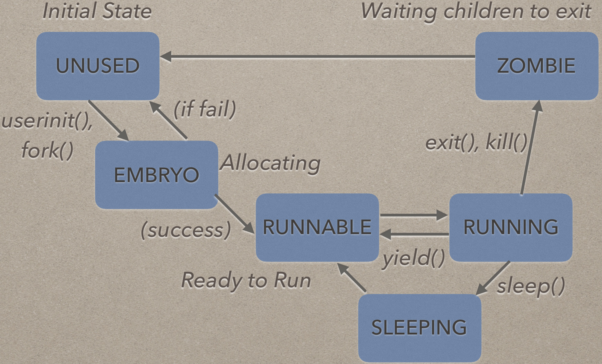
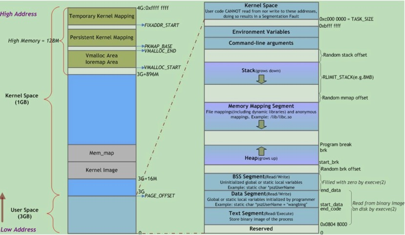

## Exercise1 源代码阅读

1. 基本头文件：types.h param.h memlayout.h defs.h x86.h asm.h mmu.h elf.h
- types.h：仅仅是定义uint, ushort, uchar pde_t别名；

```bash
typedef unsigned int   uint;
typedef unsigned short ushort;
typedef unsigned char  uchar;
typedef uint pde_t;
```
- parame.h 利用宏定义了进程最大数量，进程的内核栈大小，CPU的最大数量，进程能打开的文件描述符数等；

```bash
#define NPROC        64  // maximum number of processes
#define KSTACKSIZE 4096  // size of per-process kernel stack
#define NCPU          8  // maximum number of CPUs
#define NOFILE       16  // open files per process
#define NFILE       100  // open files per system
#define NBUF         10  // size of disk block cache
#define NINODE       50  // maximum number of active i-nodes
#define NDEV         10  // maximum major device number
#define ROOTDEV       1  // device number of file system root disk
#define MAXARG       32  // max exec arguments
#define LOGSIZE      10  // max data sectors in on-disk log
```
- 	memlayout.h：利用宏定义内存空间范围，地址和偏移的转换等；
- defs.h：内部包含了许多前向声明，同时声明了许多全局函数，这些全局函数的实现在具体使用的模块定义；
- x86.h：定义了许多C代码与汇编指令交互的内敛函数，同时定义了从用户态陷入内核态的数据结构struct trapframe; 
- 	asm.h：汇编宏定义；
- mmu.h：内存管理单元，进程地址空间详细数据结构；
- elf.h：声明了elf格式的目标文件有关的数据结构。

2. 进程线程部分：vm.c proc.h proc.c swtch.S kalloc.c以及相关其他文件代码
- vm.c：内存管理接口，比如页表申请，页表释放，页目录的转换，cpu与进程的绑定等；
- proc.h：声明了cpu、进程、进程上下文等数据结构；
swtch.S：内部是上下文切换的汇编指令，保存换出进程的现场，加载换入进程的现场；
- 	kalloc.c：物理内存的申请和释放。主要接口：void kinit1(void * vstart, void * vend), kinit2(void * vstart, void * vend), char * kalloc(void), void kfree(char * v)。

## Exercise2 带着问题阅读

1. 什么是进程？什么是线程？操作系统的资源分配单位和调度单位分别是什么？XV6 中的进程和线程分别是什么，都实现了吗?	
- 进程是在多道程序系统出现以后，为了描述系统内部各作业的活动规律而引进的概念。进程有3个基本状态：运行状态、就绪状态和等待状态；进程是具有独立功能的程序关于某个数据集合上的一次运行活动；
- 	线程是轻量级的进程，线程是进程内的一个相对独立的可执行的单元，若把进程称为任务的话，那么线程则是应用中的一个子任务的执行；
- 	操作系统的资源分配的单位是进程，处理机调度的单位是线程；
- 	xv6操作系统实现了一个基于进程 (没有实现线程) 的简单进程管理机制。XV6中进程和CPU的数据结构见proc.h。

```bash
// proc.h 
// 上下文切换现场
struct context {
  uint edi;
  uint esi;
  uint ebx;
  uint ebp;
  uint eip;
};
// 枚举进程状态
enum procstate { UNUSED, EMBRYO, SLEEPING, RUNNABLE, RUNNING, ZOMBIE };

// Per-process state
struct proc {
  uint sz;                     // Size of process memory (bytes)
  pde_t* pgdir;                // Page table
  char *kstack;                // Bottom of kernel stack for this process
  enum procstate state;        // Process state
  volatile int pid;            // Process ID
  struct proc *parent;         // Parent process
  struct trapframe *tf;        // Trap frame for current syscall
  struct context *context;     // swtch() here to run process
  void *chan;                  // If non-zero, sleeping on chan
  int killed;                  // If non-zero, have been killed
  struct file *ofile[NOFILE];  // Open files
  struct inode *cwd;           // Current directory
  char name[16];               // Process name (debugging)
};
```
2. 	进程管理的数据结构是什么？在 Windows，Linux，XV6 中分别叫什么名字？其中包含哪些内容？操作系统是如何进行管理进程管理数据结构的？它们是如何初始化的？
- 进程管理的数据结构是进程控制块 (PCB );
- Linux下为/include/linux/sched.h内部的struct task_struct，其中包括管理进程所需的各种信息。创建一个新进程时，系统在内存中申请一个空的task_struct ，并填入所需信息。同时将指向该结构的指针填入到task[]数组中。当前处于运行状态进程的PCB用指针数组current_set[]来指出。这是因为 Linux 支持多处理机系统，系统内可能存在多个同时运行的进程，故 current_set定义成指针数组；
- 	Windows下用EPROCESS(执行体进程对象)表示 ， PCB 也称为内核进程块KPROCESS(KPROCESS即内核进程对象 )，EPOCESS和KPROCESS位于内核空间 ；
- XV6下在proc .h内声明，包括进程 ID ，进程状态 ，父进程，context，cpu记录了内存地址和栈指针等。XV6中通过get_raw_proc()对进程进行控制管理，get_raw_proc()方法可以创建一个新的进程并对进程进行初始化分配进程页表和内核堆栈。

3. 	XV6中进程有哪些状态? 请画出XV6 的进程状态转化图。在Linux中，进程的状态分别包括哪些? 你认为操作系统的设计者为什么会有这样的设计思路?

- XV6中进程各状态及转换图如下：



- Linux 的进程状态可分为R (TASK_RUNNING)，可执行状态，S (TASK_INTERRUPTIBLE)，可中断的睡眠状态，D(TASK_UNINTERRUPTIBLE)不可中断的睡眠状态，T(TASK_STOPPED or TASK_TRACED)暂停状态或跟踪状态，Z(TASK_DEAD - EXIT_ZOMBIE)退出状态但资源未回收，称为僵尸进程，X (TASK_DEAD - EXIT_DEAD)退出状态，进程即将被销毁。
- 	设计这这样设计的目的，是为了cpu能够根据进程的状态进行更好的调度，提高cpu的利用率，适应io密集型和cpu密集型的进程，避免cpu的浪费。

4.	如何启动多进程(创建子进程)? 如何调度多进程，调度算法有哪些? 操作系统为何要限制一个CPU最大支持的进程数?  XV6中的最大进程数是多少？如何执行进程的切换? 什么是进程上下文? 多进程和多CPU有什么关系? 

- 父进程可以利用fork()函数创建多个子进程。首先，为每个新建的子进程分配一个空闲的proc结构并赋予子进程唯一标识pid；其次，以一次一页的方式复制父进程地址空间（采用cow写时复制），获得子进程继承的共享资源的指针；最后将子进程加入就绪队列，对子进程返回标识符0，向父进程返回子进程pid；
- 	cpu使用规定的调度算法从就绪队列选择一个进程执行，常用调度算法：时间片轮转调度、先来先服务、短作业优先调度策略、基于优先级的可抢占调度策略、基于优先级的不可抢占式调度策略、最短剩余时间优先算法、高响应比优先算法、多级反馈队列算法等；
- 	一是内存空间有限，如果读入的进程数量过多，势必会吃掉大量的内存空间，而cpu在调度过程中也会从栈或堆上申请空间，如果申请失败则无法继续运行。二是增加了缺页中断的可能性，会导致cpu不断的执行页面换入换出，使得大部分时间浪费在无意义的事情上；
- 	XV6的最大进程数见param.h文件中的#define NPROC 64，最大64；
- 进程切换是一个进程让出处理器，由另一个进程占用处理器的过程。进程的切换是由进程状态的变化引起的，而进程状态的变化又与出现的事件有关。当有事件(中断或异常)发生时，当前运行进程暂停，保存当前进程的现场，然后根据调度算法从就绪队列选一个进程换入CPU，同时加载换入进程的现场进行执行；
- 进程的上下文包括当前进程的程序计数 器PC和当前运行的CPU中各个寄存器的内容。当进程切换和发生中断的时候这些信息要保存下来以便于下次运行时使用；
- 同一时刻每个cpu上只能有一个进程被执行，且同一时刻一个进程只能被一个cpu调度，同一时刻多个cpu可以同时调度不同的进程，同一时间段内每个cpu可以调度多个进程。

5. 	内核态进程是什么? 用户态进程是什么? 它们有什么区别?  
	
- 多数系统将处理器工作状态划分为内核态和用户态。前者一般指操作系统管理程序运行的状态，具有较高的特权级别，又称为特权态、系统态或管态；后者一般指用户程序运行时的状态；具有较低的特权级别，又称为普通态、目态。区分了用户态和内核态就是限定用户什么操作可以做，什么操作不能让用户直接做。如果遇到不能让用户直接做的操作，用户就必须请求操作系统做系统调用，这样操作系统就会进入内核态进行系统操作。内核态的进程就是系统进入内核态之后进行系统操作所产生的进程；
- 用户态进程是用户通过请求操作而产生的进程；
- 	区别: 运行在不同的系统状态，用户态进程执行在用户态，内核态进程执行在内核态；进入方式不同，用户态进程可直接进入，内核态必须通过运行系统调用命令；返回方式不同，用户态进程直接返回，内核态进程有重新调度过程；内核态进程优先级要高于用户态进程，并且内核态进程特权级别最高，它可以执行系统级别的代码。

6. 	进程在内存中是如何布局的？ 进程的堆和栈有什么区别? 
- 内存分为内核空间和用户空间，内核空间一般运行操作系统程序，而用户空间一般运行用户程序。主要目的是对系统程序进行包含。进程在内存中包含堆、栈、数据段、代码段。代码段 : 保存程序的执行码，在进程并发时，代码段是共享的且只读的，在存储器中只需有一个副本。数据段 : 此段又称为初始化数据段，它包含了程序中已初始化的全局变量、全局静态变量、局部静态变量。
- 栈 : 程序执行前静态分配的内存空间，栈的大小可在编译时指定，Linux环境下默认为 8M。栈段是存放程序执行时局部变量、函数调用信息、中断现场保留信息的空间。程序执行时，CPU堆栈段指针会在栈顶根据执行情况进行上下移动。
- 堆 : 程序执行时, 按照程序需要动态分配的内存空间，使用malloc、 calloc、realloc函数分配的空间都在堆上分配。




## 参考文献

[1] [xv6进程与内存管理-CSDN](https://blog.csdn.net/thecrazyboy/article/details/12121297)
[2] [linux进程地址空间-博客园](https://www.cnblogs.com/wuchanming/p/4339770.html)
[3] [xv6进程线程-百度文库](https://wenku.baidu.com/view/07c61910ec3a87c24128c464.html)
[4] 操作系统-进程线程模型课件

